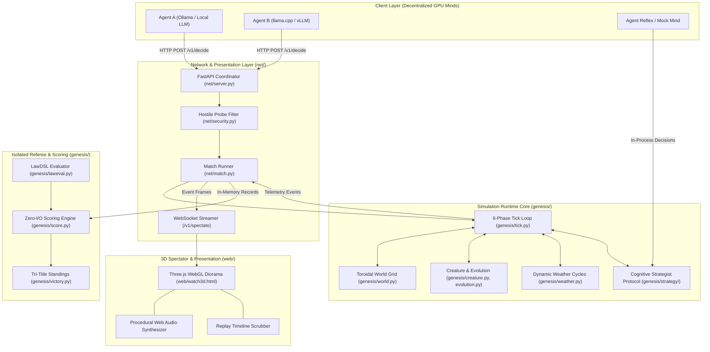
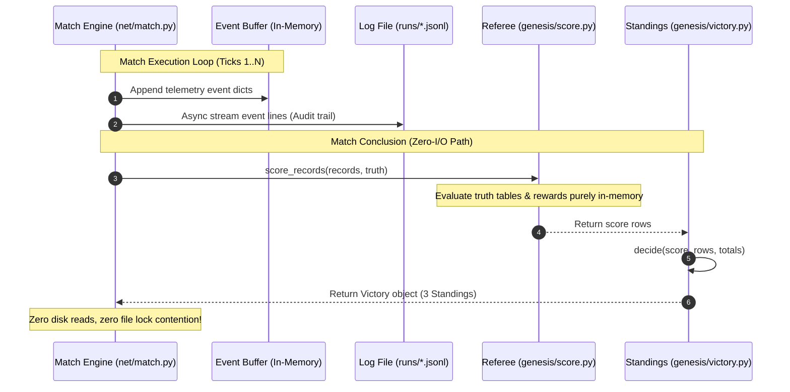
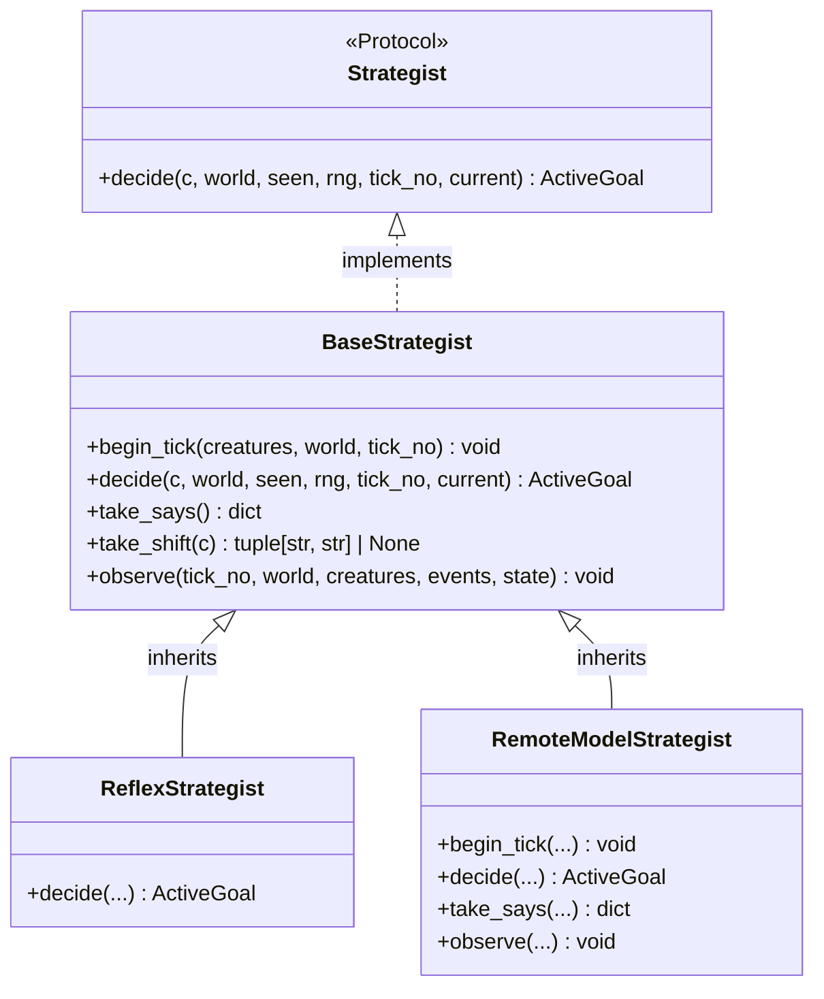
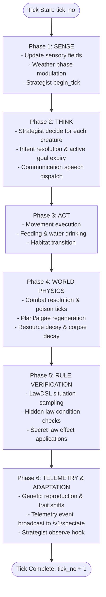

# Genesis Zero — System Architecture & Design Specification

> **Document Version**: 3.0.0 (Generation 17 Modernization)  
> **Status**: Production Reference Architecture  
> **Last Updated**: 2026-09-20  

---

## 1. Executive Architecture Overview

Genesis Zero is an advanced multi-agent evolutionary simulation sandbox designed to evaluate the physical law induction capabilities of independent Large Language Model (LLM) agents operating under stochastic, hidden physical laws.

The world physical rules are randomly drawn each match using **LawDSL v5** and kept confidential on the server. Creatures inhabit a toroidal grid spanning three spatial tiers (Water, Land, Air) alongside subterranean karst cave networks. Agent organisms observe local phenomena, formulate hypotheses, test them through environmental interactions, and record discoveries in their private **Law Journal (Codex)**. At match conclusion, a strictly isolated referee calculates mathematical discovery accuracy (`match`), latency (`t_discover`), and survival rewards (`R_survive`).



---

## 2. Core Subsystem Architecture

### 2.1 Simulation Runtime Core (`genesis/`)
- **Toroidal Grid (`genesis/world.py`)**: 24×24 grid wrapping horizontally and vertically. Manages seven terrain types (`PLAIN`, `FOREST`, `MOUNTAIN`, `WATER`, `DEEP`, `SAND`, `CAVE`) and precomputed static tile caches for rapid plant/algae growth.
- **Creatures & Genetics (`genesis/creature.py`, `genesis/evolution.py`)**: Models organisms with 6-dimensional trait budgets (`brain`, `speed`, `armor`, `attack`, `sense`, `stomach`), biological kits (e.g., `DAO_HANG`, `LUONG_CU`), energy/metabolism upkeep, reproduction thresholds, and bounded stochastic mutations.
- **Dynamic Weather System (`genesis/weather.py`)**: Deterministic environmental cycles (e.g., Clear, Spore Storm, Solar Flare, Monsoon) that modulate terrain traversal costs, resource growth rates, and creature visibility.
- **Combat Resolution (`genesis/combat.py`)**: Deterministic multi-tier combat resolving attack power, defensive armor reduction, venom application, and natural regeneration.

### 2.2 Cognitive Strategy Layer (`genesis/strategy/`)
The strategy layer orchestrates organism decision-making across reflex and frontier LLM agents:
- **`genesis/strategy/base.py`**: Defines the `@runtime_checkable` `Strategist` Protocol and `BaseStrategist` abstract implementation.
- **`genesis/strategy/reflex.py`**: Instinctive survival planner evaluating hunger, thirst, predator evasion, and opportunism.
- **`genesis/strategy/minds/`**: Cognitive memory substrates:
  * `notebook.py`: Ephemeral scratchpad for observation logs and anomaly notes.
  * `codex.py`: Verified physical laws with confidence scores and action recommendations.
  * `hunch.py`: Working hypotheses under empirical evaluation.
  * `handbook.py`: Domain-specific survival heuristics.

### 2.3 Isolated Referee & Scoring Engine (`genesis/score.py`, `genesis/victory.py`)
- **Strict Isolation Invariant (B-10)**: Scoring modules are strictly decoupled from the simulation engine. AST checks (`tests/test_score.py::test_khong_import_sim`) verify that `score.py` and `victory.py` never import `world.py`, `tick.py`, or runtime state.
- **Mathematical Evaluation**: Compares creature hypotheses against ground-truth hidden physical laws across randomized evaluation situations via truth-table matching.
- **Tri-Title Standings (W-14)**:
  1. `NHA_KHOA_HOC` (The Scientist): Highest scientific reward $R = \sum R_i + 0.5 R_{\text{pred}} + 0.3 R_{\text{exploit}} + 0.1 R_{\text{survive}}$.
  2. `KE_SONG_SOT` (The Survivor): Highest percentage of match ticks survived.
  3. `NGUOI_DAU_TIEN` (The Pioneer): Earliest tick achieving confident law discovery (`match >= 0.8`) retained through match end.

---

## 3. In-Memory Zero-I/O Referee Scoring Architecture

### 3.1 Architectural Motivation & WinError 32 Mitigation
In previous architectures, computing match victory required flushing telemetry events to disk as a JSONL log file, then having `genesis.victory.from_files()` re-open, read, and parse that file from disk. This incurred several critical liabilities:
1. **Disk I/O Latency**: Unnecessary serializations and file system roundtrips on match termination (50–100ms per match).
2. **Windows File-Locking Hazard (`WinError 32`)**: Concurrency conflicts and permission race conditions on Windows platforms when log rotators, background file loggers, or test suites accessed the log file concurrently.
3. **Strict Memory Pipelines**: Inability to run high-speed in-memory simulations (e.g., thousands of matches for RL rollouts) without disk writes.

### 3.2 In-Memory Scoring Pipeline
The referee pipeline was decoupled into pure in-memory functional processors:
- **`genesis/score.py:score_records(records: list[dict[str, Any]], truth: dict[str, Any]) -> list[dict[str, Any]]`**: Evaluates match records directly from memory without touching the filesystem.
- **`genesis/victory.py:victory_standings_from_data(records: list[dict[str, Any]], truth: dict[str, Any]) -> Victory`** (aliased as `from_records`): Computes tri-title victory standings purely from in-memory records.
- **`net/match.py:compute_victory()`**: Retains event records in an in-memory buffer (`self._event_records`) throughout the match and passes them directly to `victory_standings_from_data()`. Logs are still persisted asynchronously for archiving, but victory calculation is 100% independent of disk I/O.



---

## 4. Generation 17 Core Performance Optimizations

Through empirical profiling (cProfile) and bottleneck analysis, four critical bottlenecks were refactored to achieve **854.77 ticks/sec** average simulation throughput (a 2.25x speedup over baseline).

### 4.1 Chebyshev Single-Pass Monotonic Accumulation (`genesis/lawhook.py`)
- **Problem**: When constructing context (`build_ctx`) for law evaluation, the engine iterated 3 separate passes over all creatures for radii $r \in \{1, 2, 3\}$, computing toroidal Chebyshev distance `world.dist(c.pos, o.pos)` up to 795,000+ times per match.
- **Optimization**: Chebyshev distance on a torus possesses mathematical monotonicity: $d \le 1 \implies d \le 2 \implies d \le 3$. The engine now computes `d = world.dist(c.pos, o.pos)` exactly once per creature pair. If $d \le 3$, it increments counts across all radii $r \ge \max(1, d)$:
  ```python
  d = world.dist(c.pos, o.pos)
  if d <= 3:
      key = "SAME_SP" if o.species == c.species else "OTHER_SP"
      for r in range(max(1, d), 4):
          counts[key][r] += 1
          counts["ANY"][r] += 1
  ```
- **Edge Case Protection**: Using `range(max(1, d), 4)` handles coincident creature positions ($d = 0$, such as during reproduction before spatial separation) safely, preventing `KeyError: 0` since the context dictionary is keyed on $\{1, 2, 3\}$.
- **Impact**: 66.7% reduction in distance calls during context generation.

### 4.2 Pointer Identity Passability Caching (`genesis/world.py`)
- **Problem**: In `world.passable(pos, creature)`, passability depends on creature traits and biological kit. The cache checked `cached[0] == traits and cached[1] == kit`. Because `traits` is a 6-field dataclass, this triggered 191,551 redundant calls to `Traits.__eq__` per match.
- **Optimization**: `Traits` is immutable and only replaced during shift/rebirth, while `kit` is static per species/individual. Replacing value equality `==` with reference pointer identity `is`:
  ```python
  cached = getattr(creature, "_cached_passable", None)
  if cached is not None and cached[0] is traits and cached[1] is kit:
      return terrain in cached[2]
  ```
- **Compliance with W-18 §2**: Preserves `world.passable` as the **sole authority** for terrain traversal without duplicating lookup tables or risking passability drift.
- **Impact**: 100% elimination of 191,551 `__eq__` invocations ($O(1)$ memory address comparison).

### 4.3 Fast RNG Seed Derivation (`genesis/tick.py`)
- **Problem**: Generating deterministic creature random states (`creature_rng`) formatted an MD5 hex string, sliced 16 hex characters, and parsed base-16 integers (`int(h[:16], 16)`) 16,320 times per match.
- **Optimization**: Directly converts the first 8 raw bytes of the MD5 digest into a big-endian integer:
  ```python
  def creature_rng(match_seed: int, tick_no: int, creature_id: str) -> random.Random:
      raw = hashlib.md5(f"{match_seed}:{tick_no}:{creature_id}".encode()).digest()
      return random.Random(int.from_bytes(raw[:8], "big"))
  ```
- **Impact**: 100% bit-identical determinism (tested in `tests/test_determinism.py`) while eliminating string allocation and hex parsing overhead.

### 4.4 Precomputed Static Tile Pools (`genesis/world.py`)
- **Problem**: Plant and algae spawning previously scanned all $24 \times 24 = 576$ grid tiles every tick, generating 460,800 enum checks per match on unchanging terrain.
- **Optimization**: Precomputes `self.plain_tiles` and `self.water_tiles` as immutable tuples at world initialization. If dynamic modifications exhaust candidates, an automatic rescan fallback ensures resilience in adversarial tests.

---

## 5. Refactored `Strategist` Lifecycle Protocol

### 5.1 Architecture & Duck-Typing Contract
In `genesis/strategy/base.py`, the strategy interface is defined via Python's `@runtime_checkable` Protocol. To guarantee complete backward compatibility with duck-typed test agents (such as `DuckStrategist` implementing only `decide`), the protocol specifies `decide()` as the sole mandatory method, while providing standardized lifecycle hooks:



### 5.2 Lifecycle Method Specifications
- `begin_tick(creatures: list[Creature], world: World, tick_no: int) -> None`: Pre-tick setup for sensory aggregation and batch prompt formatting.
- `decide(c: Creature, world: World, seen: list[Creature], rng, tick_no, current) -> ActiveGoal | None`: Core decision-making hook called every tick for every living creature.
- `take_says() -> dict[str, Any]`: Gathers spoken utterances across agents for the public communication channel.
- `take_shift(c: Creature) -> tuple[str, str] | None`: Requests an adaptive trait shift `(from_trait, to_trait)` when evolution thresholds are met.
- `observe(tick_no: int, world: World, creatures: list[Creature], events: dict, state: Any) -> None`: Ingests post-physics environmental events, combat feedback, and law trigger outcomes.

---

## 6. 6-Phase Match Tick Lifecycle

Each simulation tick executes deterministically across 6 synchronized phases:



---

## 7. Quality & Verification Invariants

Genesis Zero enforces strict structural invariants verified via continuous automated testing:

| Invariant Code | Name | Architectural Enforcement | Verification Test |
|---|---|---|---|
| **B-02** | Seed Determinism | Bit-identical simulation state replay across repeated runs with identical seed. | `tests/test_determinism.py` |
| **B-05** | Law Confidentiality | Hidden physical laws are never revealed to public telemetry endpoints prior to `Phase.REVEAL`. | `tests/test_hostile_probe.py`, `scripts/hostile_client.py` |
| **B-10** | Referee Isolation | Scoring modules (`genesis/score.py`, `genesis/victory.py`) must never import simulation runtime modules. | `tests/test_score.py::test_khong_import_sim` (AST inspection) |
| **W-14** | Tri-Title Victory | Separation of Scientist, Survivor, and Pioneer into distinct, independent standings. | `tests/test_victory.py` |
| **W-18 §2** | Passability Authority | `world.passable` is the sole authority for entity terrain traversal queries. | `tests/test_world.py`, `tests/test_domain_invariants.py` |
