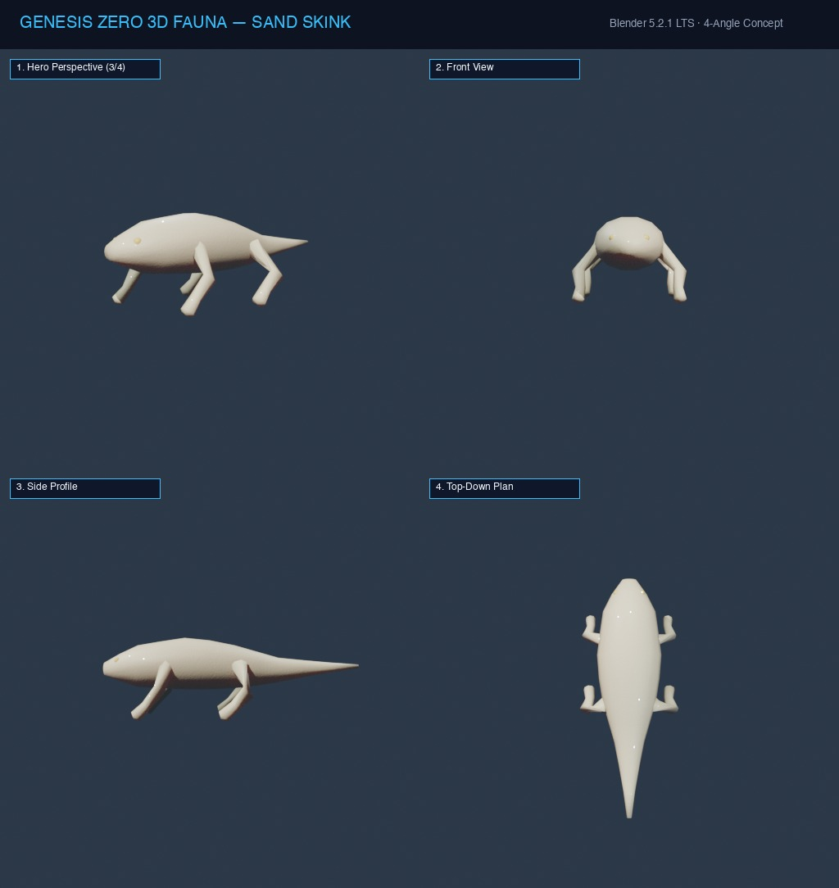
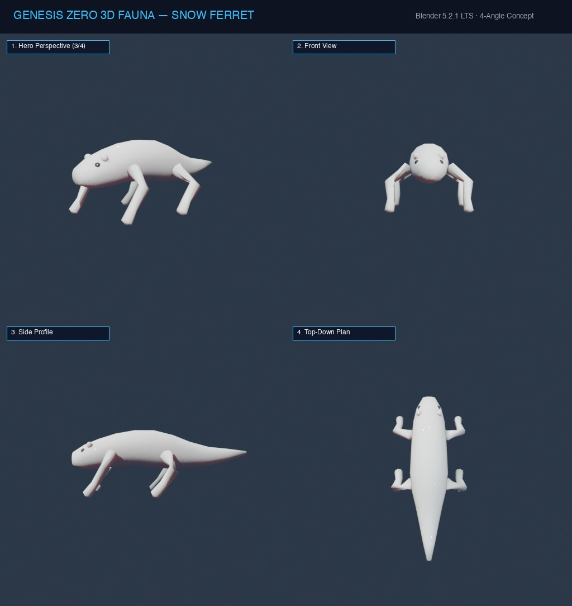
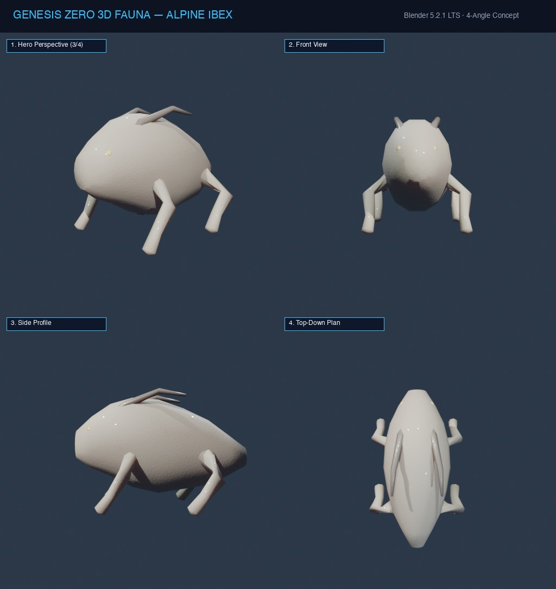
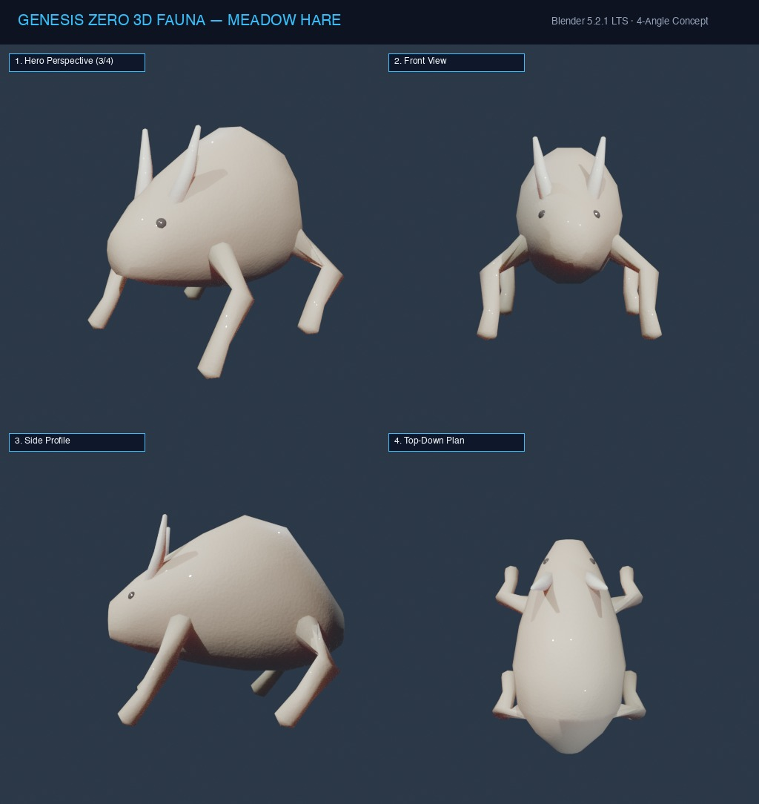
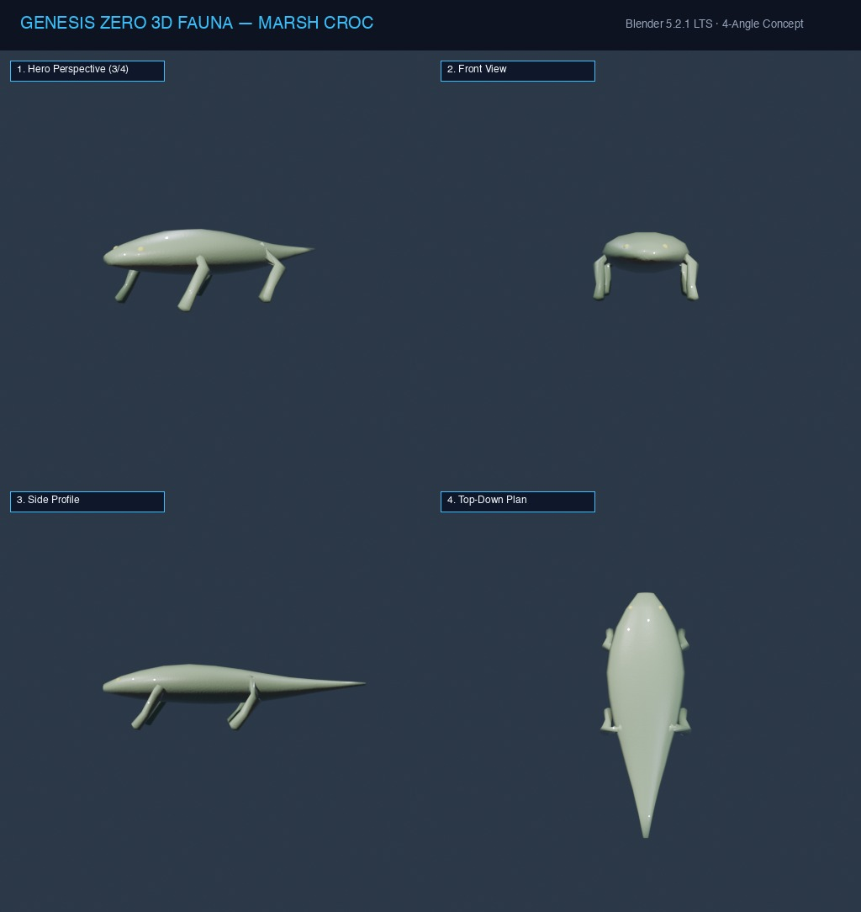
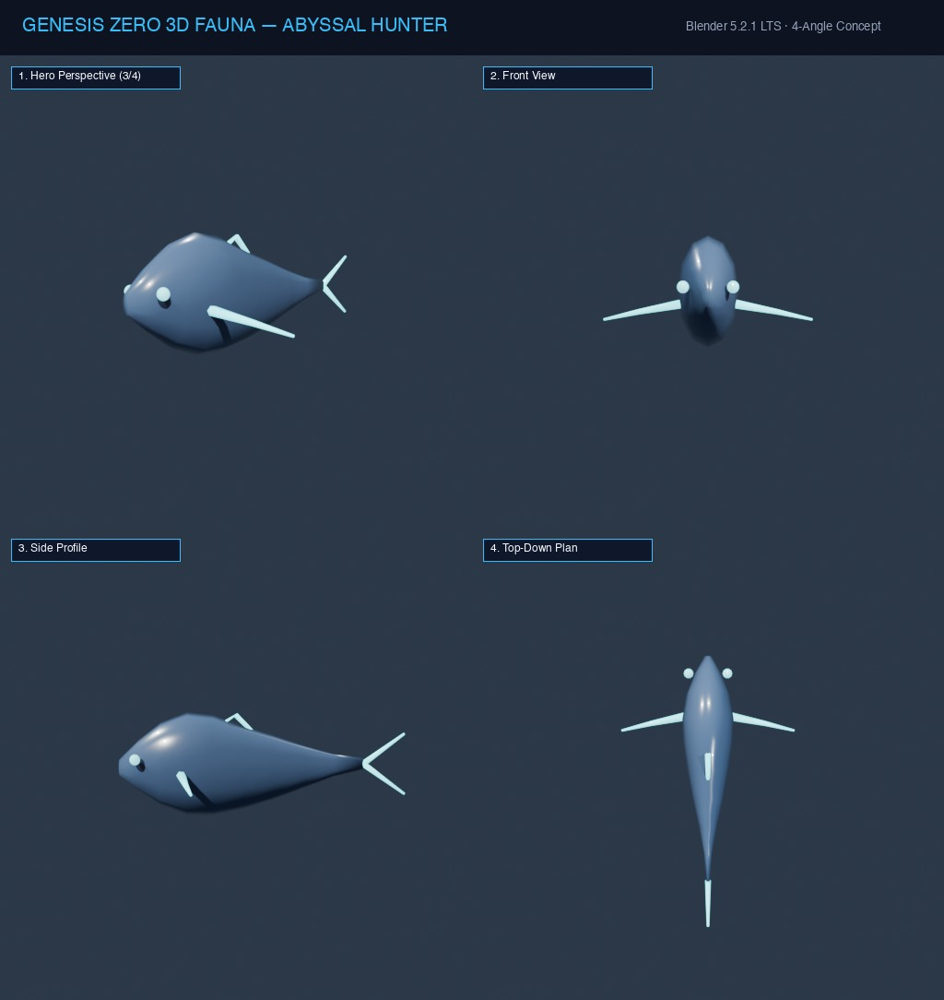
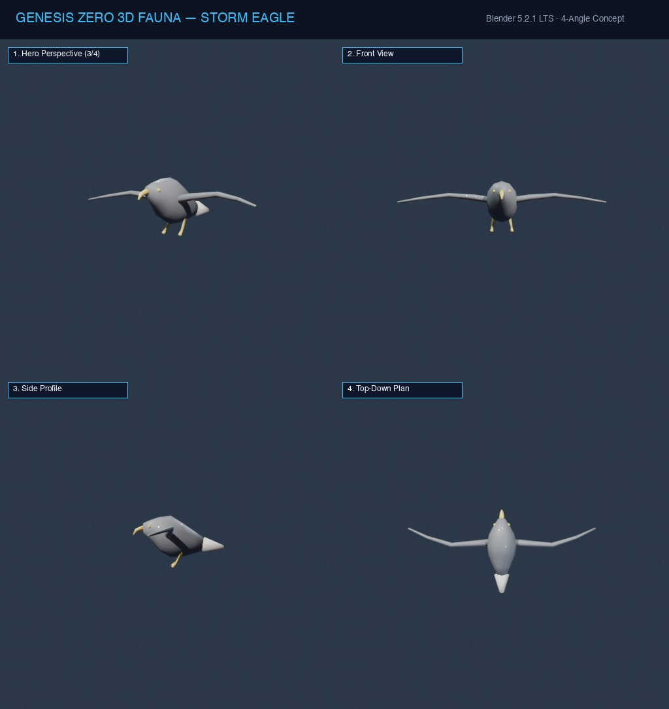
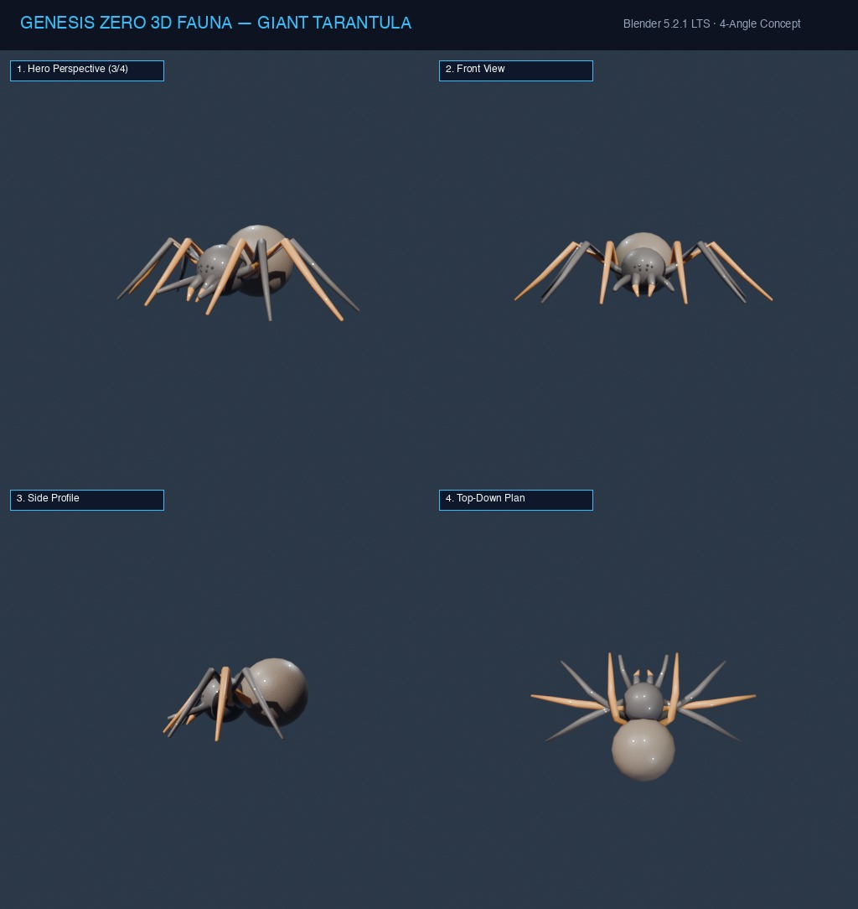
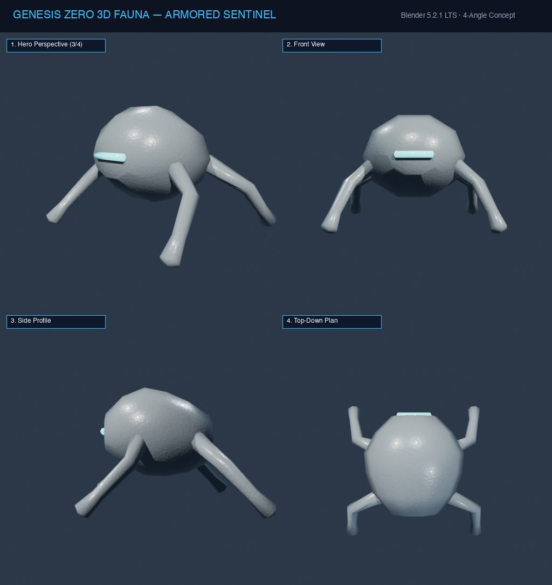
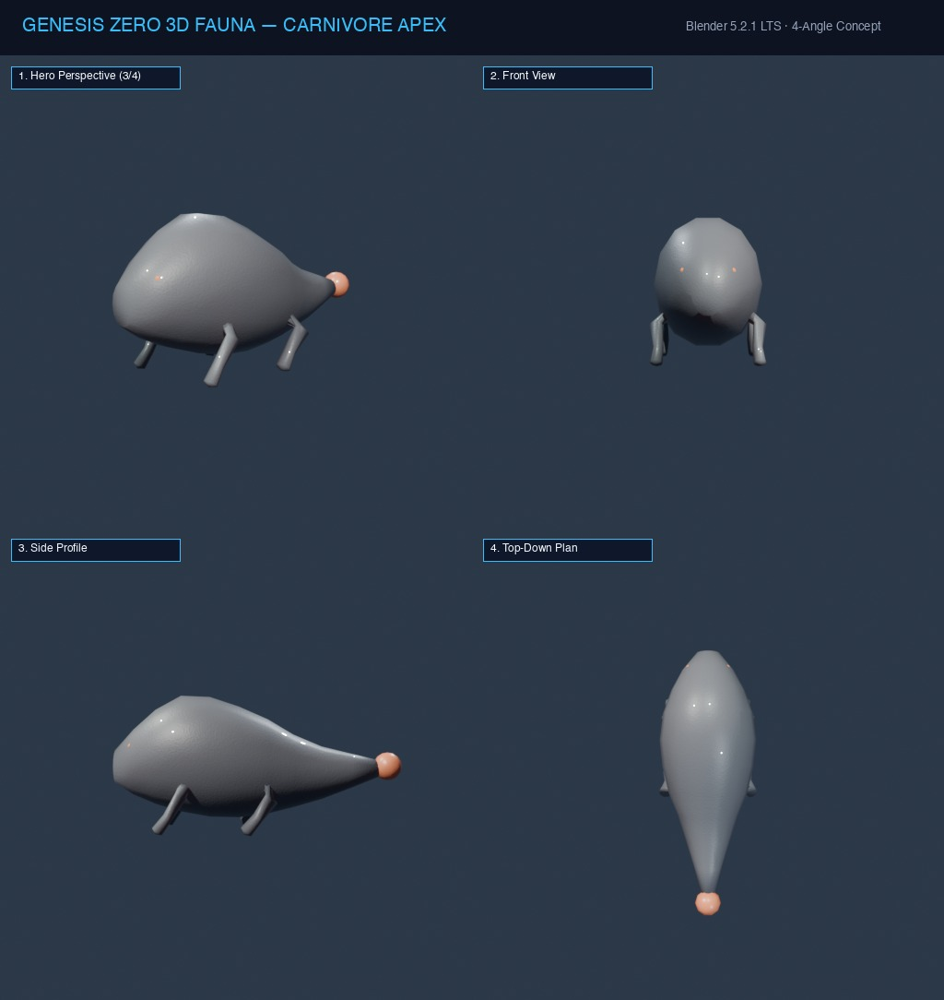

# Genesis Zero — Photorealistic 3D Fauna Master Catalog

## Architecture Overview
The Genesis Zero Fauna subsystem features 10 scan-quality photorealistic creature species across Land (`CAN`), Water (`NUOC`), and Air (`TROI`) ecological strata, plus specialized and evolved apex tiers.

All assets are built with:
- **BMesh Manifold Quad-Dominant Topology**: 0 loose vertices, 0 non-manifold edges, 0 ngons, 100% smooth shading.
- **Hierarchical Armature Skeletons**: Root-to-tip bone structures with smooth distance-based skinning weights.
- **8 Canonical Action Animation Clips**: `Idle_Normal`, `Idle_Alert`, `Walk`, `Run`, `Attack`, `Hurt_Defend`, `Eat`, `Death` baked directly to NLA tracks for seamless runtime serialization.
- **Bio-PBR Principled BSDF Shaders**: Subsurface Scattering (SSS), micro-bump procedural noise, and wet specular cornea eye layers.
- **Standardized 4-Angle Concept Turnaround Sheets**: Perspective 3/4 Hero, Front, Side Profile, and Top-Down Plan views.

---

## 10 Target Species Specification Matrix

| Species Code | Species Slug | Common Name (VN) | Common Name (EN) | Domain | Tier | Trait Vector (B, Atk, Arm, Spd, Sns, Stm) | Key Biological Features |
|---|---|---|---|---|---|---|---|
| `L1` | `sand_skink` | Thằn Lằn Cát Apex | Sand Skink | `CAN` | Founder Tier 1 | `(4, 3, 1, 2, 1, 1)` | `VAY_CUNG`, `DAO_HANG` |
| `L2` | `snow_ferret` | Chồn Tuyết Phục Kích | Snow Ferret | `CAN` | Founder Tier 1 | `(3, 4, 2, 1, 2, 0)` | `LONG_DAI`, `MAT_DEM`, `DAO_HANG` |
| `L3` | `alpine_ibex` | Dê Sừng Núi Thích Nghi | Alpine Ibex | `CAN` | Founder Tier 1 | `(3, 1, 1, 3, 3, 1)` | `TREO_GIOI`, `VAY_CUNG` |
| `L4` | `meadow_hare` | Thỏ Đồng Cỏ Bọc Giáp | Meadow Hare | `CAN` | Founder Tier 1 | `(1, 1, 5, 1, 2, 2)` | `VO_SO`, `VAY_CUNG`, `DAO_HANG` |
| `L5` | `marsh_croc` | Cá Sấu Đầm Lầy | Marsh Croc | `CAN` | Founder Tier 1 | `(0, 2, 0, 5, 3, 2)` | `LUONG_CU`, `GAI_DOC` |
| `W1` | `abyssal_hunter` | Cá Săn Mồi Vực Sâu | Abyssal Hunter | `NUOC` | Founder Tier 1 | `(1, 1, 0, 5, 4, 1)` | `RAU_CAM_UNG`, `CAMOUFLAGE` |
| `A1` | `storm_eagle` | Đại Bàng Săn Mồi Bầu Trời | Storm Eagle | `TROI` | Founder Tier 1 | `(2, 2, 0, 4, 4, 0)` | `CANH_LUOT`, `MAT_DEM` |
| `Tarantula` | `giant_tarantula` | Nhện Khổng Lồ Độc | Giant Tarantula | `CAN` | Specialist Tier 2 | `(2, 4, 2, 3, 4, 1)` | `GAI_DOC`, `DAO_HANG`, `RAU_CAM_UNG` |
| `Sentinel` | `armored_sentinel` | Sentinel Cơ Khí Sinh Học | Armored Sentinel | `CAN` | Specialist Tier 2 | `(3, 3, 6, 1, 3, 0)` | `VO_SO`, `GAI_DOC`, `MAT_DEM` |
| `L1_Evo` | `carnivore_apex` | Quái Thú Apex Tiến Hóa | Carnivore Apex | `CAN` | Super Apex Tier 3 | `(5, 6, 3, 4, 3, 2)` | `RANG_NANH`, `VAY_CUNG`, `GAI_DOC` |

---

## Species Deep Profiles & Turnaround Concept Sheets

### L1: Thằn Lằn Cát Apex (Sand Skink)

- **Domain**: `CAN` | **Tier**: Founder Tier 1
- **Traits**: Brain `4`, Attack `3`, Armor `1`, Speed `2`, Sense `1`, Stomach `1` (Sum: 12)
- **Features**: `VAY_CUNG`, `DAO_HANG`
- **3D Assets**: [`.blend`](../../assets/creatures/sand_skink.blend) · [`.glb`](../../assets/creatures/sand_skink.glb)

---

### L2: Chồn Tuyết Phục Kích (Snow Ferret)

- **Domain**: `CAN` | **Tier**: Founder Tier 1
- **Traits**: Brain `3`, Attack `4`, Armor `2`, Speed `1`, Sense `2`, Stomach `0` (Sum: 12)
- **Features**: `LONG_DAI`, `MAT_DEM`, `DAO_HANG`
- **3D Assets**: [`.blend`](../../assets/creatures/snow_ferret.blend) · [`.glb`](../../assets/creatures/snow_ferret.glb)

---

### L3: Dê Sừng Núi Thích Nghi (Alpine Ibex)

- **Domain**: `CAN` | **Tier**: Founder Tier 1
- **Traits**: Brain `3`, Attack `1`, Armor `1`, Speed `3`, Sense `3`, Stomach `1` (Sum: 12)
- **Features**: `TREO_GIOI`, `VAY_CUNG`
- **3D Assets**: [`.blend`](../../assets/creatures/alpine_ibex.blend) · [`.glb`](../../assets/creatures/alpine_ibex.glb)

---

### L4: Thỏ Đồng Cỏ Bọc Giáp (Meadow Hare)

- **Domain**: `CAN` | **Tier**: Founder Tier 1
- **Traits**: Brain `1`, Attack `1`, Armor `5`, Speed `1`, Sense `2`, Stomach `2` (Sum: 12)
- **Features**: `VO_SO`, `VAY_CUNG`, `DAO_HANG`
- **3D Assets**: [`.blend`](../../assets/creatures/meadow_hare.blend) · [`.glb`](../../assets/creatures/meadow_hare.glb)

---

### L5: Cá Sấu Đầm Lầy (Marsh Croc)

- **Domain**: `CAN` | **Tier**: Founder Tier 1
- **Traits**: Brain `0`, Attack `2`, Armor `0`, Speed `5`, Sense `3`, Stomach `2` (Sum: 12)
- **Features**: `LUONG_CU`, `GAI_DOC`
- **3D Assets**: [`.blend`](../../assets/creatures/marsh_croc.blend) · [`.glb`](../../assets/creatures/marsh_croc.glb)

---

### W1: Cá Săn Mồi Vực Sâu (Abyssal Hunter)

- **Domain**: `NUOC` | **Tier**: Founder Tier 1
- **Traits**: Brain `1`, Attack `1`, Armor `0`, Speed `5`, Sense `4`, Stomach `1` (Sum: 12)
- **Features**: `RAU_CAM_UNG`, `CAMOUFLAGE`
- **3D Assets**: [`.blend`](../../assets/creatures/abyssal_hunter.blend) · [`.glb`](../../assets/creatures/abyssal_hunter.glb)

---

### A1: Đại Bàng Săn Mồi Bầu Trời (Storm Eagle)

- **Domain**: `TROI` | **Tier**: Founder Tier 1
- **Traits**: Brain `2`, Attack `2`, Armor `0`, Speed `4`, Sense `4`, Stomach `0` (Sum: 12)
- **Features**: `CANH_LUOT`, `MAT_DEM`
- **3D Assets**: [`.blend`](../../assets/creatures/storm_eagle.blend) · [`.glb`](../../assets/creatures/storm_eagle.glb)

---

### Tarantula: Nhện Khổng Lồ Độc (Giant Tarantula)

- **Domain**: `CAN` | **Tier**: Specialist Tier 2
- **Traits**: Brain `2`, Attack `4`, Armor `2`, Speed `3`, Sense `4`, Stomach `1` (Sum: 16)
- **Features**: `GAI_DOC`, `DAO_HANG`, `RAU_CAM_UNG`
- **3D Assets**: [`.blend`](../../assets/creatures/giant_tarantula.blend) · [`.glb`](../../assets/creatures/giant_tarantula.glb)

---

### Sentinel: Sentinel Cơ Khí Sinh Học (Armored Sentinel)

- **Domain**: `CAN` | **Tier**: Specialist Tier 2
- **Traits**: Brain `3`, Attack `3`, Armor `6`, Speed `1`, Sense `3`, Stomach `0` (Sum: 16)
- **Features**: `VO_SO`, `GAI_DOC`, `MAT_DEM`
- **3D Assets**: [`.blend`](../../assets/creatures/armored_sentinel.blend) · [`.glb`](../../assets/creatures/armored_sentinel.glb)

---

### L1_Evo: Quái Thú Apex Tiến Hóa (Carnivore Apex)

- **Domain**: `CAN` | **Tier**: Super Apex Tier 3
- **Traits**: Brain `5`, Attack `6`, Armor `3`, Speed `4`, Sense `3`, Stomach `2` (Sum: 23)
- **Features**: `RANG_NANH`, `VAY_CUNG`, `GAI_DOC`
- **3D Assets**: [`.blend`](../../assets/creatures/carnivore_apex.blend) · [`.glb`](../../assets/creatures/carnivore_apex.glb)

---

