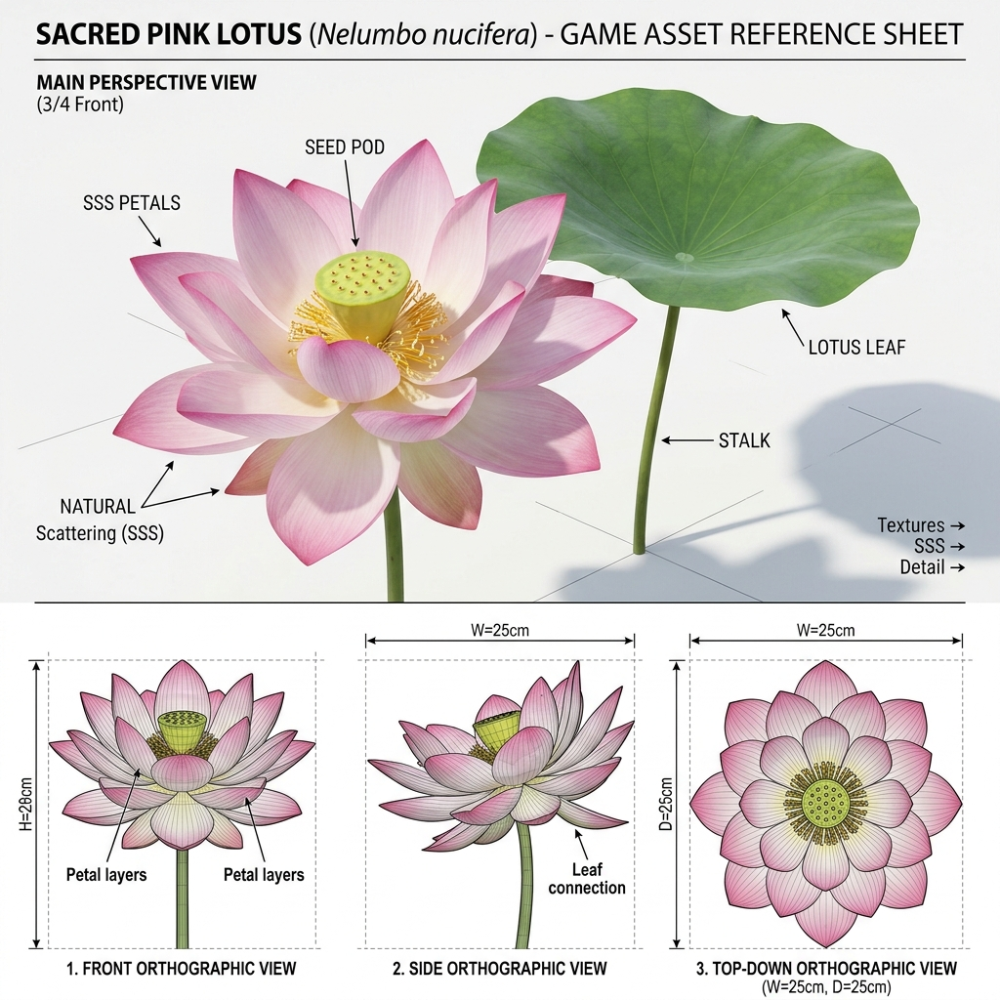

# Đặc Tả Thực Vật 3D: Sen Hồng Cổ Điển Hoàng Cung (Nelumbo nucifera Gaertn.)

> [!NOTE]
> **Mã Định Danh**: `AQ02`  
> **Nhóm Hình Thái**: Aquatic Wetland  
> **Hệ Thống Phân Loại (APG IV / Phylogeny)**: Angiosperms > Eudicots > Proteales > Nelumbonaceae  
> **Danh Pháp Khoa Học**: *Nelumbo nucifera* Gaertn.  
> **Tên Tiếng Anh**: **Sacred Pink Lotus / Indian Lotus**  
> **Tầng Sinh Thái**: Thủy Sinh & Đầm Lầy (Aquatic & Wetland)  
> **Kích Thước Không Gian**: 1.6m (Cao vươn khỏi nước) x 1.4m (Tán lá) x 0.12m (Bát sen)  
> **Mã Cơ Sở Dữ Liệu Đối Chiếu**: POWO: `605335-1` | WFO: `wfo-0000473489` | GBIF: `2888881` | CoL: `467R8` | vncreatures: Bản địa Việt Nam (`VNC0198`)  
> **Tình Trạng Bảo Tồn**: IUCN Red List: LC (Least Concern) | CITES: Không  
> **Phân Bố Tự Nhiên**: Đầm lầy, vụng sông cạn nhiệt đới & cận nhiệt châu Á  
> **Sinh Cảnh Genesis Zero**: Đầm lầy phù sa, bờ vịnh hạ lưu nước ngọt ấm (Z: 4.5m - 5.2m)  
> **Tiêu Chuẩn Đồ Họa**: **Hyper-Realistic Scan-Quality (Blender PBR + SSS)**

---

## Bản Vẽ Thiết Kế 3D Model Sheet (4 Góc Nhìn: Phối Cảnh, Mặt Trước, Mặt Bên, Nhìn Từ Trên)



---


## 1. Giải Phẫu Hình Thái Thực Vật Học (Botanical Anatomy)

### 1.1 Cấu Trúc Tổng Quan
Khác với hoa súng, lá và hoa sen vươn cao khỏi mặt nước trên cuống gai cứng cáp. Lá hình khiên tròn trũng lòng máng, đóa sen hồng lớn tỏa ngát hương với đài sen hình nón ngược.

### 1.2 Chi Tiết Vi Mô & Dấu Ấn Scan (Micro-Geometry & Surface Detail)
Bát sen đài hoa có các lỗ tròn chứa hạt sen xanh non, nhụy tơ vàng bao quanh đài, cuống lá phủ gai nhọn li ti bảo vệ thân ngập nước.

---

## 2. Thông Số Kiến Trúc Lưới 3D (3D Mesh Topology & LODs)

| Thông Số Lưới | Tiêu Chuẩn Scan-Quality | Mô Tả Kỹ Thuật |
|:---|:---|:---|
| **LOD0 (Ultra High)** | **46,000 tris** | Lưới Quads sạch 100%, Manifold kín nước, hỗ trợ Subdivision Surface |
| **LOD1 (Game Engine)** | **11,000 tris** | Tối ưu hóa render thời gian thực, giữ nguyên vẹn Normal Map vi mô |
| **LOD2 (Diorama/Far)** | ~1,200 - 2,500 tris | Dạng Billboard / Low-poly cho góc nhìn viễn cảnh toàn cảnh diorama |
| **Smooth Shading** | `use_smooth = True` | Kích hoạt 100% trên toàn bộ các mặt đa giác, triệt tiêu gãy khúc |
| **UV Unwrapping** | Non-overlapping Island | Tỷ lệ Texel Density đồng đều (2048 px/m), seam giấu khéo léo |

---

## 3. Hệ Thống Vật Liệu Sinh Học PBR (Biological PBR Shader Network)

Vật liệu được xây dựng trên hệ thống Shader chuyên sâu của Blender 5.2.1 LTS:

- **Shader Profile**: `Principled BSDF: Cánh hoa chuyển sắc từ trắng ở gốc sang hồng sen rực rỡ ở ngọn (#f472b6, SSS 0.68), Đài sen vàng lục (#ca8a04), Lá chống thấm tuyệt đối Roughness 0.10, Sheen 0.40.`
- **Subsurface Scattering (SSS)**: Tái hiện chân thực cơ chế ánh sáng đi sâu vào mô tế bào diệp lục và tán xạ ngược ra ngoài khi ngược sáng.
- **Normal & Procedural Displacement**: Tái tạo các khe nứt vỏ cây già cỗi, gờ sống lá, lông tơ nhung và độ cong vi mô của cánh hoa.
- **Color Management**: Tối ưu hóa chuẩn không gian màu **AgX (Medium High Contrast)** cho hình ảnh chân thực và rực rỡ.

---

## 4. Đường Dẫn Tài Nguyên File 3D (Direct Asset Links)

Bạn có thể mở trực tiếp các file 3D của loài thực vật này tại các liên kết sau:

- 🎨 **File Nguồn Blender 3D**: [`aquatic_sacred_lotus.blend`](../../../assets/flora/aquatic_wetland/aquatic_sacred_lotus.blend)
- 🚀 **File Xuất Chuẩn Engine glTF/GLB**: [`aquatic_sacred_lotus.glb`](../../../assets/flora/aquatic_wetland/aquatic_sacred_lotus.glb)
- 📷 **Bản Vẽ Turnaround 4 Góc**: [`aquatic_sacred_lotus_turnaround.jpg`](../images/aquatic_sacred_lotus_turnaround.jpg)
- 🐍 **Mã Nguồn Sinh Hình Học Procedural**: [`flora_builder.py`](../../../assets/flora/generators/flora_builder.py)

---

## 5. Script Nạp Nhanh Vào Scene Hiện Tại (Python Snippet)

```python
import os
import bpy

asset_path = "/Users/duongnad/Documents/project/Genesis_Zero/assets/flora/aquatic_wetland/aquatic_sacred_lotus.glb"
if os.path.exists(asset_path):
    bpy.ops.import_scene.gltf(filepath=asset_path)
    plant = bpy.context.selected_objects[0]
    plant.name = "Flora_aquatic_sacred_lotus"
    print(f"✓ Đã đặt {plant.name} vào thế giới Genesis Zero.")
else:
    print(f"Asset file đang được sinh bởi flora_builder.py...")
```
