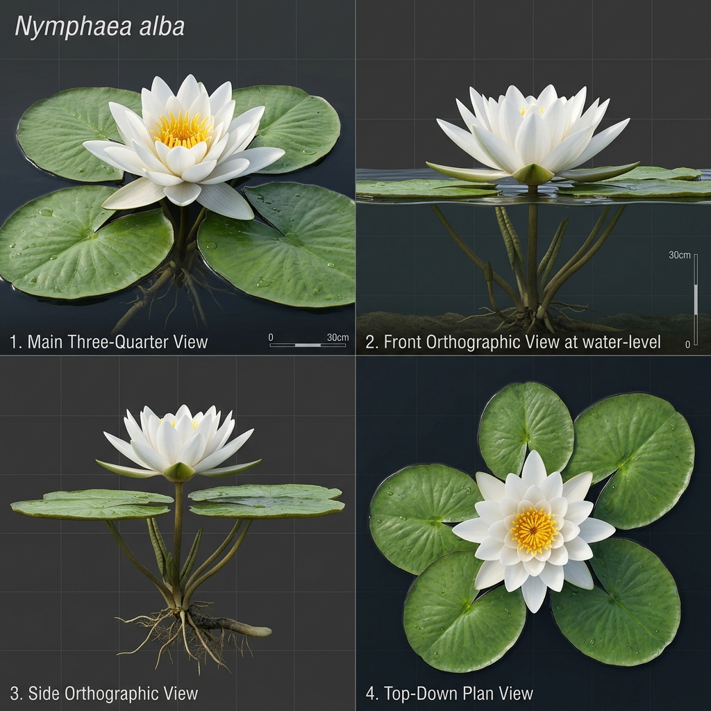

# Đặc Tả Thực Vật 3D: Hoa Súng Trắng Nước Ngọt (Nymphaea alba L.)

> [!NOTE]
> **Mã Định Danh**: `AQ01`  
> **Nhóm Hình Thái**: Aquatic Wetland  
> **Hệ Thống Phân Loại (APG IV / Phylogeny)**: Basal Angiosperms (ANA grade) > Nymphaeales > Nymphaeaceae  
> **Danh Pháp Khoa Học**: *Nymphaea alba* L.  
> **Tên Tiếng Anh**: **European White Water Lily**  
> **Tầng Sinh Thái**: Thủy Sinh & Đầm Lầy (Aquatic & Wetland)  
> **Kích Thước Không Gian**: 0.2m (Cao mặt nước) x 1.8m (Tán lá) x 2.5m (Chiều dài cuống)  
> **Mã Cơ Sở Dữ Liệu Đối Chiếu**: POWO: `605417-1` | WFO: `wfo-0000473523` | GBIF: `2882443` | CoL: `486CP` | vncreatures: Chi *Nymphaea* bản địa VN  
> **Tình Trạng Bảo Tồn**: IUCN Red List: LC (Least Concern) | CITES: Không  
> **Phân Bố Tự Nhiên**: Mặt hồ nước lặng, đầm lầy châu Âu, Bắc Phi, Tây Á  
> **Sinh Cảnh Genesis Zero**: Hồ trung tâm nước lặng, vịnh cạn ven bờ (Z: 4.5m - 4.8m)  
> **Tiêu Chuẩn Đồ Họa**: **Hyper-Realistic Scan-Quality (Blender PBR + SSS)**

---

## Bản Vẽ Thiết Kế 3D Model Sheet (4 Góc Nhìn: Phối Cảnh, Mặt Trước, Mặt Bên, Nhìn Từ Trên)



---

## 1. Giải Phẫu Hình Thái Thực Vật Học (Botanical Anatomy)

### 1.1 Cấu Trúc Tổng Quan
Lá tròn dẹt nổi bồng bềnh trên mặt nước có khe khuyết hình chữ V sâu đến cuống. Đóa hoa súng trắng muốt 20-25 cánh xếp nhiều lớp tỏa tròn kiêu sa, nhụy hoa vàng rực.

### 1.2 Chi Tiết Vi Mô & Dấu Ấn Scan (Micro-Geometry & Surface Detail)
Mặt trên lá bóng mượt phủ lớp sáp kỵ nước (Lotus effect) làm nước đọng thành hạt cầu tròn, mặt dưới lá phớt tím có các khoang khí xốp giúp lá nổi.

---

## 2. Thông Số Kiến Trúc Lưới 3D (3D Mesh Topology & LODs)

| Thông Số Lưới | Tiêu Chuẩn Scan-Quality | Mô Tả Kỹ Thuật |
|:---|:---|:---|
| **LOD0 (Ultra High)** | **32,000 tris** | Lưới Quads sạch 100%, Manifold kín nước, hỗ trợ Subdivision Surface |
| **LOD1 (Game Engine)** | **7,500 tris** | Tối ưu hóa render thời gian thực, giữ nguyên vẹn Normal Map vi mô |
| **LOD2 (Diorama/Far)** | ~1,200 - 2,500 tris | Dạng Billboard / Low-poly cho góc nhìn viễn cảnh toàn cảnh diorama |
| **Smooth Shading** | `use_smooth = True` | Kích hoạt 100% trên toàn bộ các mặt đa giác, triệt tiêu gãy khúc |
| **UV Unwrapping** | Non-overlapping Island | Tỷ lệ Texel Density đồng đều (2048 px/m), seam giấu khéo léo |

---

## 3. Hệ Thống Vật Liệu Sinh Học PBR (Biological PBR Shader Network)

Vật liệu được xây dựng trên hệ thống Shader chuyên sâu của Blender 5.2.1 LTS:

- **Shader Profile**: `Principled BSDF: Cánh hoa trắng muốt thấu quang cao SSS 0.70 (#ffffff), Nhụy hoa vàng óng (#eab308), Lá mặt trên xanh bóng (#15803d, Roughness 0.15, Clearcoat 0.45), Mặt dưới phớt tím đỏ (#701a75).`
- **Subsurface Scattering (SSS)**: Tái hiện chân thực cơ chế ánh sáng đi sâu vào mô tế bào diệp lục và tán xạ ngược ra ngoài khi ngược sáng.
- **Normal & Procedural Displacement**: Tái tạo các khe nứt vỏ cây già cỗi, gờ sống lá, lông tơ nhung và độ cong vi mô của cánh hoa.
- **Color Management**: Tối ưu hóa chuẩn không gian màu **AgX (Medium High Contrast)** cho hình ảnh chân thực và rực rỡ.

---

## 4. Đường Dẫn Tài Nguyên File 3D (Direct Asset Links)

Bạn có thể mở trực tiếp các file 3D của loài thực vật này tại các liên kết sau:

- 🎨 **File Nguồn Blender 3D**: [`aquatic_water_lily.blend`](../../../assets/flora/aquatic_wetland/aquatic_water_lily.blend)
- 🚀 **File Xuất Chuẩn Engine glTF/GLB**: [`aquatic_water_lily.glb`](../../../assets/flora/aquatic_wetland/aquatic_water_lily.glb)
- 📷 **Bản Vẽ Turnaround 4 Góc**: [`aquatic_water_lily_turnaround.jpg`](../images/aquatic_water_lily_turnaround.jpg)
- 🐍 **Mã Nguồn Sinh Hình Học Procedural**: [`flora_builder.py`](../../../assets/flora/generators/flora_builder.py)

---

## 5. Script Nạp Nhanh Vào Scene Hiện Tại (Python Snippet)

```python
import os
import bpy

asset_path = "/Users/duongnad/Documents/project/Genesis_Zero/assets/flora/aquatic_wetland/aquatic_water_lily.glb"
if os.path.exists(asset_path):
    bpy.ops.import_scene.gltf(filepath=asset_path)
    plant = bpy.context.selected_objects[0]
    plant.name = "Flora_aquatic_water_lily"
    print(f"✓ Đã đặt {plant.name} vào thế giới Genesis Zero.")
else:
    print(f"Asset file đang được sinh bởi flora_builder.py...")
```
