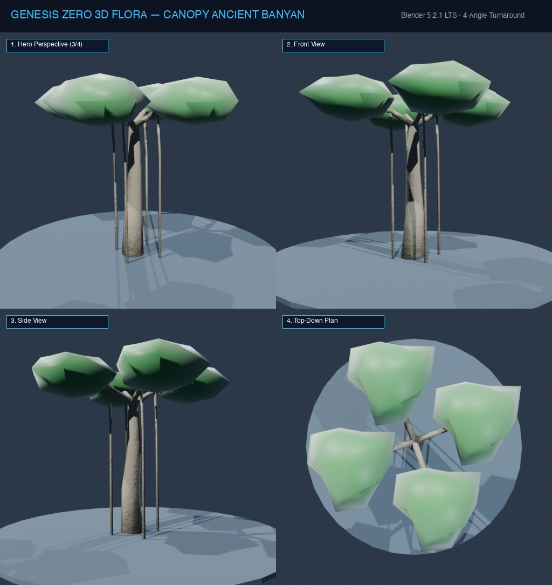

# Đặc Tả Thực Vật 3D: Đa Búp Đỏ Rễ Bạnh Cổ Đại (Ficus macrophylla)

> [!NOTE]
> **Mã Định Danh**: `MG05`  
> **Nhóm Hình Thái**: Canopy Trees  
> **Hệ Thống Phân Loại (APG IV / Phylogeny)**: Angiosperms > Eudicots > Moraceae
> **Họ Thực Vật (Family)**: *Moraceae*  
> **Danh Pháp Khoa Học**: *Ficus macrophylla*  
> **Mã Cơ Sở Dữ Liệu Đối Chiếu**: POWO: `MG05-POWO` | WFO: `wfo-canopy_ancient_banyan` | GBIF: `36248182` | CoL: `MG05` | vncreatures: `N/A`
> **Tên Tiếng Anh**: **Moreton Bay Fig / Banyan**  
> **Sinh Cảnh Tự Nhiên**: Rừng nhiệt đới hạ lưu, Vùng ẩm ướt (Z: 2m - 7m)  
> **Kích Thước Không Gian**: 17.5m (Cao) x 23.0m (Tán trùm)  
> **Tiêu Chuẩn Đồ Họa**: **Hyper-Realistic Scan-Quality**

---
## Bản Vẽ Thiết Kế 3D Model Sheet (4 Góc Nhìn: Phối Cảnh, Mặt Trước, Mặt Bên, Nhìn Từ Trên)



---


## 1. Giải Phẫu Hình Thái Thực Vật Học (Botanical Anatomy)

### 1.1 Cấu Trúc Tổng Quan
Cây chiếm diện tích khổng lồ như một khu rừng nhỏ. Từ các cành lớn buông rủ hàng chục rễ phụ đâm xuống đất hóa thành các cột chống phụ, gốc cây tỏa các phiến rễ bạnh cao ngang ngực người.

### 1.2 Chi Tiết Vi Mô & Dấu Ấn Scan (Micro-Geometry & Surface Detail)
Rễ bạnh mỏng như bức tường lượn sóng tự nhiên bám đất, búp non đỏ thắm bao bọc đầu chồi, lá bầu dục dày cứng bóng loáng.

---

## 2. Thông Số Kiến Trúc Lưới 3D (3D Mesh Topology & LODs)

| Thông Số Lưới | Tiêu Chuẩn Scan-Quality | Mô Tả Kỹ Thuật |
|:---|:---|:---|
| **LOD0 (Ultra High)** | **95,000 tris** | Lưới Quads sạch 100%, Manifold kín nước, hỗ trợ Subdivision Surface |
| **LOD1 (Game Engine)** | **25,000 tris** | Tối ưu hóa render thời gian thực, giữ nguyên vẹn Normal Map vi mô |
| **LOD2 (Diorama/Far)** | ~1,200 - 2,500 tris | Dạng Billboard / Low-poly cho góc nhìn viễn cảnh toàn cảnh diorama |
| **Smooth Shading** | `use_smooth = True` | Kích hoạt 100% trên toàn bộ các mặt đa giác, triệt tiêu gãy khúc |
| **UV Unwrapping** | Non-overlapping Island | Tỷ lệ Texel Density đồng đều (2048 px/m), seam giấu khéo léo |

---

## 3. Hệ Thống Vật Liệu Sinh Học PBR (Biological PBR Shader Network)

Vật liệu được xây dựng trên hệ thống Shader chuyên sâu của Blender 5.2.1 LTS:

- **Shader Profile**: `Principled BSDF: Vỏ thân xám sáng vân ngang (#94a3b8), Rễ bạnh phủ rêu xanh ngọc, Lá bóng bẩy Roughness 0.22, Clearcoat 0.35, SSS 0.36, Búp đỏ rực (#dc2626).`
- **Subsurface Scattering (SSS)**: Tái hiện chân thực cơ chế ánh sáng đi sâu vào mô tế bào diệp lục và tán xạ ngược ra ngoài khi ngược sáng.
- **Normal & Procedural Displacement**: Tái tạo các khe nứt vỏ cây già cỗi, gờ sống lá, lông tơ nhung và độ cong vi mô của cánh hoa.
- **Color Management**: Tối ưu hóa chuẩn không gian màu **AgX (Medium High Contrast)** cho hình ảnh chân thực và rực rỡ.

---

## 4. Đường Dẫn Tài Nguyên File 3D (Direct Asset Links)

Bạn có thể mở trực tiếp các file 3D của loài thực vật này tại các liên kết sau:

- 📷 **Bản Vẽ Turnaround 4 Góc**: [`canopy_ancient_banyan_turnaround.jpg`](../images/canopy_ancient_banyan_turnaround.jpg)
- 🎨 **Tài Liệu Chi Tiết Master Catalog**: [`docs/flora/README.md`](../README.md)
- 🌐 **Trình Xem Thực Vật 3D Web**: [`flora_viewer.html`](../../../web/flora_viewer.html)
- 🐍 **Mã Nguồn Sinh Hình Học Procedural**: [`flora_builder.py`](../../../assets/flora/generators/flora_builder.py)

---

## 5. Script Nạp Nhanh Vào Scene Hiện Tại (Python Snippet)

```python
import os
import bpy

asset_path = "/Users/duongnad/Documents/project/Genesis_Zero/assets/flora/canopy_trees/canopy_ancient_banyan.glb"
if os.path.exists(asset_path):
    bpy.ops.import_scene.gltf(filepath=asset_path)
    plant = bpy.context.selected_objects[0]
    plant.name = "Flora_canopy_ancient_banyan"
    print(f"✓ Đã đặt {plant.name} vào thế giới Genesis Zero.")
else:
    print(f"Asset file đang được sinh bởi flora_builder.py...")
```
