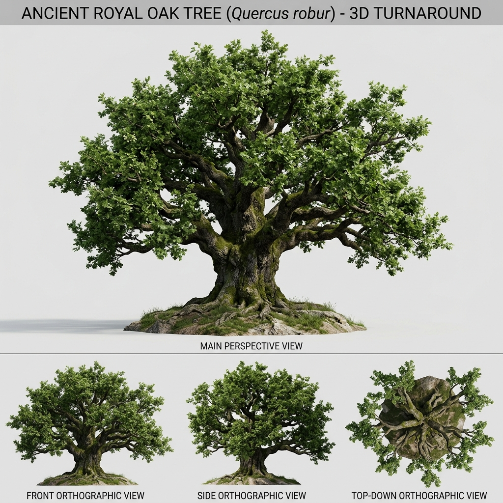

# Đặc Tả Thực Vật 3D: Sồi Cổ Thụ Hoàng Gia (Quercus robur L.)

> [!NOTE]
> **Mã Định Danh**: `MG01`  
> **Nhóm Hình Thái**: Canopy Trees  
> **Hệ Thống Phân Loại (APG IV / Phylogeny)**: Angiosperms > Eudicots > Rosids > Fabids > Fagales > Fagaceae  
> **Danh Pháp Khoa Học**: *Quercus robur* L.  
> **Tên Tiếng Anh**: **Royal English Oak / Pedunculate Oak**  
> **Tầng Sinh Thái**: Cây Đại Thụ (Canopy)  
> **Kích Thước Không Gian**: 28m (Cao) x 25m (Tán) x 3.5m (DBH)  
> **Mã Cơ Sở Dữ Liệu Đối Chiếu**: POWO: `296681-1` | WFO: `wfo-0000293123` | GBIF: `2878688` | CoL: `4QVD4` | vncreatures: `N/A`  
> **Tình Trạng Bảo Tồn**: IUCN Red List: LC (Least Concern) | CITES: Không  
> **Phân Bố Tự Nhiên**: Rừng ôn đới rụng lá châu Âu, Tiểu Á, dãy Kavkaz  
> **Sinh Cảnh Genesis Zero**: Trọng tâm đồng bằng, Trái tim bản đồ diorama (Z: 4m - 9m)  
> **Tiêu Chuẩn Đồ Họa**: **Hyper-Realistic Scan-Quality (Blender PBR + SSS)**

---

## Bản Vẽ Thiết Kế 3D Model Sheet (4 Góc Nhìn: Phối Cảnh, Mặt Trước, Mặt Bên, Nhìn Từ Trên)



---


## 1. Giải Phẫu Hình Thái Thực Vật Học (Botanical Anatomy)

### 1.1 Cấu Trúc Tổng Quan
Thân cổ thụ khổng lồ đường kính 3.5m, gốc xòe hệ rễ bạnh gân guốc bám chặt lòng đất. Cành bàng to như thân cây thường vươn ngang uốn lượn nâng đỡ vòm tán lá sồi ngàn năm bạt ngàn.

### 1.2 Chi Tiết Vi Mô & Dấu Ấn Scan (Micro-Geometry & Surface Detail)
Vỏ cây nứt sâu rãnh 40mm phủ rêu xanh cổ xưa và địa y bạc. Hốc mắt cây cổ thụ hình oval chứa nấm ký sinh. Lá sồi thùy lượn sóng mang quả đấu nón có mũ sần sùi.

---

## 2. Thông Số Kiến Trúc Lưới 3D (3D Mesh Topology & LODs)

| Thông Số Lưới | Tiêu Chuẩn Scan-Quality | Mô Tả Kỹ Thuật |
|:---|:---|:---|
| **LOD0 (Ultra High)** | **86,000 tris** | Lưới Quads sạch 100%, Manifold kín nước, hỗ trợ Subdivision Surface |
| **LOD1 (Game Engine)** | **22,000 tris** | Tối ưu hóa render thời gian thực, giữ nguyên vẹn Normal Map vi mô |
| **LOD2 (Diorama/Far)** | ~1,200 - 2,500 tris | Dạng Billboard / Low-poly cho góc nhìn viễn cảnh toàn cảnh diorama |
| **Smooth Shading** | `use_smooth = True` | Kích hoạt 100% trên toàn bộ các mặt đa giác, triệt tiêu gãy khúc |
| **UV Unwrapping** | Non-overlapping Island | Tỷ lệ Texel Density đồng đều (2048 px/m), seam giấu khéo léo |

---

## 3. Hệ Thống Vật Liệu Sinh Học PBR (Biological PBR Shader Network)

Vật liệu được xây dựng trên hệ thống Shader chuyên sâu của Blender 5.2.1 LTS:

- **Shader Profile**: `Principled BSDF Multi-Material: Vỏ sồi nâu xám nứt nẻ (#38281b, Normal Displacement sâu, Roughness 0.95), Tán lá sồi dày SSS 0.45 (#15803d), Điểm rêu bám chân gốc (#4d7c0f).`
- **Subsurface Scattering (SSS)**: Tái hiện chân thực cơ chế ánh sáng đi sâu vào mô tế bào diệp lục và tán xạ ngược ra ngoài khi ngược sáng.
- **Normal & Procedural Displacement**: Tái tạo các khe nứt vỏ cây già cỗi, gờ sống lá, lông tơ nhung và độ cong vi mô của cánh hoa.
- **Color Management**: Tối ưu hóa chuẩn không gian màu **AgX (Medium High Contrast)** cho hình ảnh chân thực và rực rỡ.

---

## 4. Đường Dẫn Tài Nguyên File 3D (Direct Asset Links)

Bạn có thể mở trực tiếp các file 3D của loài thực vật này tại các liên kết sau:

- 🎨 **File Nguồn Blender 3D**: [`canopy_ancient_oak.blend`](../../../assets/flora/canopy_trees/canopy_ancient_oak.blend)
- 🚀 **File Xuất Chuẩn Engine glTF/GLB**: [`canopy_ancient_oak.glb`](../../../assets/flora/canopy_trees/canopy_ancient_oak.glb)
- 📷 **Bản Vẽ Turnaround 4 Góc**: [`canopy_ancient_oak_turnaround.jpg`](../images/canopy_ancient_oak_turnaround.jpg)
- 🐍 **Mã Nguồn Sinh Hình Học Procedural**: [`flora_builder.py`](../../../assets/flora/generators/flora_builder.py)

---

## 5. Script Nạp Nhanh Vào Scene Hiện Tại (Python Snippet)

```python
import os
import bpy

asset_path = "/Users/duongnad/Documents/project/Genesis_Zero/assets/flora/canopy_trees/canopy_ancient_oak.glb"
if os.path.exists(asset_path):
    bpy.ops.import_scene.gltf(filepath=asset_path)
    plant = bpy.context.selected_objects[0]
    plant.name = "Flora_canopy_ancient_oak"
    print(f"✓ Đã đặt {plant.name} vào thế giới Genesis Zero.")
else:
    print(f"Asset file đang được sinh bởi flora_builder.py...")
```
