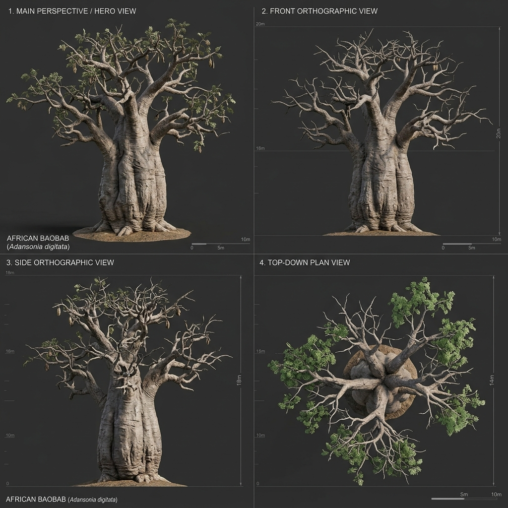

# Đặc Tả Thực Vật 3D: Baobab Bầu Nước Châu Phi (Adansonia digitata L.)

> [!NOTE]
> **Mã Định Danh**: `MG04`  
> **Nhóm Hình Thái**: Canopy Trees  
> **Hệ Thống Phân Loại (APG IV / Phylogeny)**: Angiosperms > Eudicots > Rosids > Malvids > Malvales > Malvaceae  
> **Danh Pháp Khoa Học**: *Adansonia digitata* L.  
> **Tên Tiếng Anh**: **African Baobab / Upside-Down Tree**  
> **Tầng Sinh Thái**: Cây Đại Thụ (Canopy / Savanna)  
> **Kích Thước Không Gian**: 20m (Cao) x 22m (Tán) x 9.0m (DBH)  
> **Mã Cơ Sở Dữ Liệu Đối Chiếu**: POWO: `558628-1` | WFO: `wfo-0000520448` | GBIF: `3152222` | CoL: `9X2N` | vncreatures: `N/A`  
> **Tình Trạng Bảo Tồn**: IUCN Red List: NT (Near Threatened) | CITES: Không  
> **Phân Bố Tự Nhiên**: Thảo nguyên xavan khô hạn châu Phi hạ Sahara  
> **Sinh Cảnh Genesis Zero**: Thảo nguyên xavan khô cằn, đồi đá đón nắng (Z: 4m - 9m)  
> **Tiêu Chuẩn Đồ Họa**: **Hyper-Realistic Scan-Quality (Blender PBR + SSS)**

---

## Bản Vẽ Thiết Kế 3D Model Sheet (4 Góc Nhìn: Phối Cảnh, Mặt Trước, Mặt Bên, Nhìn Từ Trên)



---

## 1. Giải Phẫu Hình Thái Thực Vật Học (Botanical Anatomy)

### 1.1 Cấu Trúc Tổng Quan
Thân cây phình to hình thùng rượu khổng lồ tích trữ nước, đường kính thân tới 6m. Đỉnh thân trổ các cành khẳng khiu ngoằn ngoèo xòe ra như bộ rễ cây chổng ngược lên trời.

### 1.2 Chi Tiết Vi Mô & Dấu Ấn Scan (Micro-Geometry & Surface Detail)
Vỏ cây nhẵn bóng màu xám ánh đồng có ánh nhũ, thân có các nếp gấp cuồn cuộn như cơ bắp voi khổng lồ.

---

## 2. Thông Số Kiến Trúc Lưới 3D (3D Mesh Topology & LODs)

| Thông Số Lưới | Tiêu Chuẩn Scan-Quality | Mô Tả Kỹ Thuật |
|:---|:---|:---|
| **LOD0 (Ultra High)** | **68,000 tris** | Lưới Quads sạch 100%, Manifold kín nước, hỗ trợ Subdivision Surface |
| **LOD1 (Game Engine)** | **17,500 tris** | Tối ưu hóa render thời gian thực, giữ nguyên vẹn Normal Map vi mô |
| **LOD2 (Diorama/Far)** | ~1,200 - 2,500 tris | Dạng Billboard / Low-poly cho góc nhìn viễn cảnh toàn cảnh diorama |
| **Smooth Shading** | `use_smooth = True` | Kích hoạt 100% trên toàn bộ các mặt đa giác, triệt tiêu gãy khúc |
| **UV Unwrapping** | Non-overlapping Island | Tỷ lệ Texel Density đồng đều (2048 px/m), seam giấu khéo léo |

---

## 3. Hệ Thống Vật Liệu Sinh Học PBR (Biological PBR Shader Network)

Vật liệu được xây dựng trên hệ thống Shader chuyên sâu của Blender 5.2.1 LTS:

- **Shader Profile**: `Principled BSDF: Vỏ thân xám đồng nhẵn bóng (#78716c, Roughness 0.45, Clearcoat 0.15), Lá chân vịt 5 lá chét xanh tươi SSS 0.40.`
- **Subsurface Scattering (SSS)**: Tái hiện chân thực cơ chế ánh sáng đi sâu vào mô tế bào diệp lục và tán xạ ngược ra ngoài khi ngược sáng.
- **Normal & Procedural Displacement**: Tái tạo các khe nứt vỏ cây già cỗi, gờ sống lá, lông tơ nhung và độ cong vi mô của cánh hoa.
- **Color Management**: Tối ưu hóa chuẩn không gian màu **AgX (Medium High Contrast)** cho hình ảnh chân thực và rực rỡ.

---

## 4. Đường Dẫn Tài Nguyên File 3D (Direct Asset Links)

Bạn có thể mở trực tiếp các file 3D của loài thực vật này tại các liên kết sau:

- 🎨 **File Nguồn Blender 3D**: [`canopy_baobab.blend`](../../../assets/flora/canopy_trees/canopy_baobab.blend)
- 🚀 **File Xuất Chuẩn Engine glTF/GLB**: [`canopy_baobab.glb`](../../../assets/flora/canopy_trees/canopy_baobab.glb)
- 📷 **Bản Vẽ Turnaround 4 Góc**: [`canopy_baobab_turnaround.jpg`](../images/canopy_baobab_turnaround.jpg)
- 🐍 **Mã Nguồn Sinh Hình Học Procedural**: [`flora_builder.py`](../../../assets/flora/generators/flora_builder.py)

---

## 5. Script Nạp Nhanh Vào Scene Hiện Tại (Python Snippet)

```python
import os
import bpy

asset_path = "/Users/duongnad/Documents/project/Genesis_Zero/assets/flora/canopy_trees/canopy_baobab.glb"
if os.path.exists(asset_path):
    bpy.ops.import_scene.gltf(filepath=asset_path)
    plant = bpy.context.selected_objects[0]
    plant.name = "Flora_canopy_baobab"
    print(f"✓ Đã đặt {plant.name} vào thế giới Genesis Zero.")
else:
    print(f"Asset file đang được sinh bởi flora_builder.py...")
```
