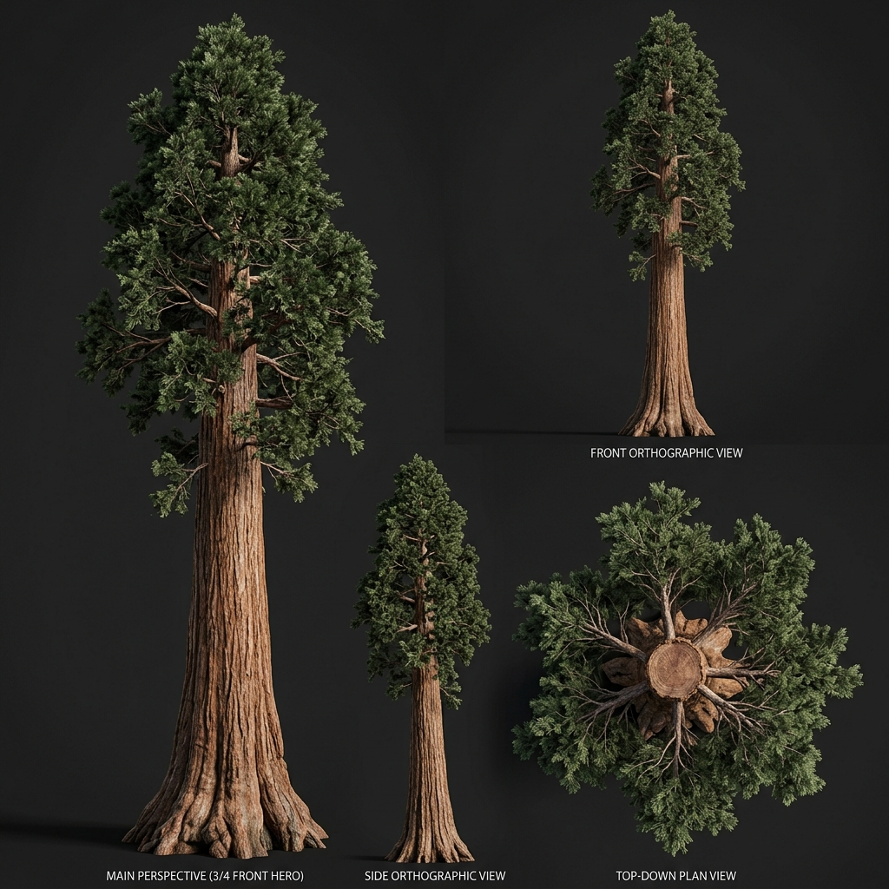

# Đặc Tả Thực Vật 3D: Cự Mộc Sequoia Đỏ Bất Tử (Sequoiadendron giganteum)

> [!NOTE]
> **Mã Định Danh**: `MG03`  
> **Nhóm Hình Thái**: Canopy Trees  
> **Hệ Thống Phân Loại (Phylogeny)**: Gymnosperms > Pinopsida > Cupressales > Cupressaceae  
> **Danh Pháp Khoa Học**: *Sequoiadendron giganteum* (Lindl.) J.Buchholz  
> **Tên Tiếng Anh**: **Giant Sequoia / Sierra Redwood**  
> **Tầng Sinh Thái**: Cây Đại Thụ / Đặc Hữu (Canopy / Endemic)  
> **Kích Thước Không Gian**: 65m (Cao) x 18m (Tán) x 6.0m (DBH)  
> **Mã Cơ Sở Dữ Liệu Đối Chiếu**: POWO: `263309-1` | WFO: `wfo-0000308871` | GBIF: `2684031` | CoL: `4WS8F` | vncreatures: `N/A`  
> **Tình Trạng Bảo Tồn**: IUCN Red List: EN (Endangered) | CITES: Không  
> **Phân Bố Tự Nhiên**: Dải hẹp sườn tây dãy Sierra Nevada, California, Hoa Kỳ  
> **Sinh Cảnh Genesis Zero**: Rừng nguyên sinh núi cao, sườn dốc hẻm núi (Z: 4m - 14m)  
> **Tiêu Chuẩn Đồ Họa**: **Hyper-Realistic Scan-Quality (Blender PBR + SSS)**

---

## Bản Vẽ Thiết Kế 3D Model Sheet (4 Góc Nhìn: Phối Cảnh, Mặt Trước, Mặt Bên, Nhìn Từ Trên)



---

## 1. Giải Phẫu Hình Thái Thực Vật Học (Botanical Anatomy)

### 1.1 Cấu Trúc Tổng Quan
Cột thân khổng lồ sừng sững đường kính gốc tới 5.0m, vươn cao chọc thủng tầng mây trời. Thân hình cột thẳng tắp, không có cành ở 12m đầu tiên, tán cây hình chóp nhọn phía trên.

### 1.2 Chi Tiết Vi Mô & Dấu Ấn Scan (Micro-Geometry & Surface Detail)
Vỏ cây dày tới 30cm bằng sợi xốp màu đỏ quế chống cháy rừng và côn trùng, xẻ các rãnh thẳng đứng sâu hoắm. Tán lá kim nhỏ dạng vảy dẹt.

---

## 2. Thông Số Kiến Trúc Lưới 3D (3D Mesh Topology & LODs)

| Thông Số Lưới | Tiêu Chuẩn Scan-Quality | Mô Tả Kỹ Thuật |
|:---|:---|:---|
| **LOD0 (Ultra High)** | **92,000 tris** | Lưới Quads sạch 100%, Manifold kín nước, hỗ trợ Subdivision Surface |
| **LOD1 (Game Engine)** | **24,000 tris** | Tối ưu hóa render thời gian thực, giữ nguyên vẹn Normal Map vi mô |
| **LOD2 (Diorama/Far)** | ~1,200 - 2,500 tris | Dạng Billboard / Low-poly cho góc nhìn viễn cảnh toàn cảnh diorama |
| **Smooth Shading** | `use_smooth = True` | Kích hoạt 100% trên toàn bộ các mặt đa giác, triệt tiêu gãy khúc |
| **UV Unwrapping** | Non-overlapping Island | Tỷ lệ Texel Density đồng đều (2048 px/m), seam giấu khéo léo |

---

## 3. Hệ Thống Vật Liệu Sinh Học PBR (Biological PBR Shader Network)

Vật liệu được xây dựng trên hệ thống Shader chuyên sâu của Blender 5.2.1 LTS:

- **Shader Profile**: `Principled BSDF: Vỏ đỏ quế nồng ấm (#9a3412 / #7c2d12, Roughness 0.95, Micro-fibers), Tán lá kim xanh sẫm (#14532d, SSS 0.25).`
- **Subsurface Scattering (SSS)**: Tái hiện chân thực cơ chế ánh sáng đi sâu vào mô tế bào diệp lục và tán xạ ngược ra ngoài khi ngược sáng.
- **Normal & Procedural Displacement**: Tái tạo các khe nứt vỏ cây già cỗi, gờ sống lá, lông tơ nhung và độ cong vi mô của cánh hoa.
- **Color Management**: Tối ưu hóa chuẩn không gian màu **AgX (Medium High Contrast)** cho hình ảnh chân thực và rực rỡ.

---

## 4. Đường Dẫn Tài Nguyên File 3D (Direct Asset Links)

Bạn có thể mở trực tiếp các file 3D của loài thực vật này tại các liên kết sau:

- 🎨 **File Nguồn Blender 3D**: [`canopy_giant_sequoia.blend`](../../../assets/flora/canopy_trees/canopy_giant_sequoia.blend)
- 🚀 **File Xuất Chuẩn Engine glTF/GLB**: [`canopy_giant_sequoia.glb`](../../../assets/flora/canopy_trees/canopy_giant_sequoia.glb)
- 📷 **Bản Vẽ Turnaround 4 Góc**: [`canopy_giant_sequoia_turnaround.jpg`](../images/canopy_giant_sequoia_turnaround.jpg)
- 🐍 **Mã Nguồn Sinh Hình Học Procedural**: [`flora_builder.py`](../../../assets/flora/generators/flora_builder.py)

---

## 5. Script Nạp Nhanh Vào Scene Hiện Tại (Python Snippet)

```python
import os
import bpy

asset_path = "/Users/duongnad/Documents/project/Genesis_Zero/assets/flora/canopy_trees/canopy_giant_sequoia.glb"
if os.path.exists(asset_path):
    bpy.ops.import_scene.gltf(filepath=asset_path)
    plant = bpy.context.selected_objects[0]
    plant.name = "Flora_canopy_giant_sequoia"
    print(f"✓ Đã đặt {plant.name} vào thế giới Genesis Zero.")
else:
    print(f"Asset file đang được sinh bởi flora_builder.py...")
```
