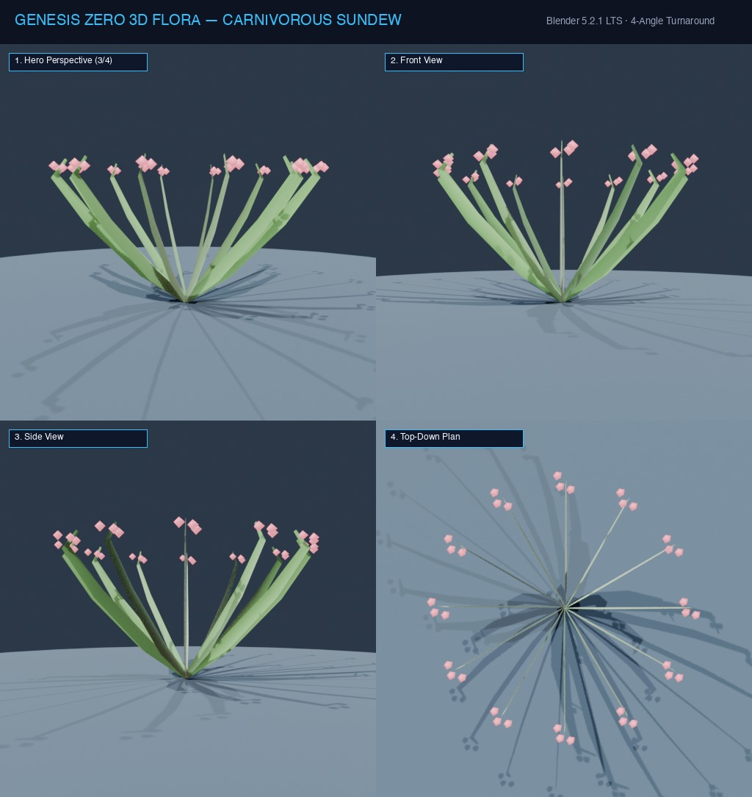

# Đặc Tả Thực Vật 3D: Cây Bắt Ruồi Bọt Nước (Drosera capensis)

> [!NOTE]
> **Mã Định Danh**: `EX03`  
> **Nhóm Hình Thái**: Carnivorous Vines  
> **Hệ Thống Phân Loại (APG IV / Phylogeny)**: Angiosperms > Eudicots > Droseraceae
> **Họ Thực Vật (Family)**: *Droseraceae*  
> **Danh Pháp Khoa Học**: *Drosera capensis*  
> **Mã Cơ Sở Dữ Liệu Đối Chiếu**: POWO: `EX03-POWO` | WFO: `wfo-carnivorous_sundew` | GBIF: `261368611` | CoL: `EX03` | vncreatures: `N/A`
> **Tên Tiếng Anh**: **Cape Sundew**  
> **Sinh Cảnh Tự Nhiên**: Bãi rêu bùn ẩm ướt nghèo dinh dưỡng (Z: 3m - 7m)  
> **Kích Thước Không Gian**: 0.32m (Cao) x 0.28m (Tán)  
> **Tiêu Chuẩn Đồ Họa**: **Hyper-Realistic Scan-Quality**

---
## Bản Vẽ Thiết Kế 3D Model Sheet (4 Góc Nhìn: Phối Cảnh, Mặt Trước, Mặt Bên, Nhìn Từ Trên)



---


## 1. Giải Phẫu Hình Thái Thực Vật Học (Botanical Anatomy)

### 1.1 Cấu Trúc Tổng Quan
Các dải lá thuôn dài mọc tỏa từ gốc, toàn bộ mặt trên lá phủ dày đặc hàng trăm xúc tu lông tuyến màu đỏ hồng, đỉnh mỗi xúc tu mang giọt chất nhầy trong suốt lấp lánh như giọt sương mai dưới nắng.

### 1.2 Chi Tiết Vi Mô & Dấu Ấn Scan (Micro-Geometry & Surface Detail)
Giọt nhầy có sức căng bề mặt tạo khối cầu trong suốt hoàn hảo có tính dẻo quánh, khi con mồi dính vào thì các xúc tu sẽ uốn cong cuộn tròn lá lại bọc lấy con mồi.

---

## 2. Thông Số Kiến Trúc Lưới 3D (3D Mesh Topology & LODs)

| Thông Số Lưới | Tiêu Chuẩn Scan-Quality | Mô Tả Kỹ Thuật |
|:---|:---|:---|
| **LOD0 (Ultra High)** | **42,000 tris** | Lưới Quads sạch 100%, Manifold kín nước, hỗ trợ Subdivision Surface |
| **LOD1 (Game Engine)** | **10,000 tris** | Tối ưu hóa render thời gian thực, giữ nguyên vẹn Normal Map vi mô |
| **LOD2 (Diorama/Far)** | ~1,200 - 2,500 tris | Dạng Billboard / Low-poly cho góc nhìn viễn cảnh toàn cảnh diorama |
| **Smooth Shading** | `use_smooth = True` | Kích hoạt 100% trên toàn bộ các mặt đa giác, triệt tiêu gãy khúc |
| **UV Unwrapping** | Non-overlapping Island | Tỷ lệ Texel Density đồng đều (2048 px/m), seam giấu khéo léo |

---

## 3. Hệ Thống Vật Liệu Sinh Học PBR (Biological PBR Shader Network)

Vật liệu được xây dựng trên hệ thống Shader chuyên sâu của Blender 5.2.1 LTS:

- **Shader Profile**: `Principled BSDF: Giọt nhầy trong suốt hoàn hảo Transmission: 0.95, Roughness: 0.05, IOR: 1.34, Xúc tu lông tơ đỏ tía (#be123c, SSS 0.70), Phiến lá xanh non dẻo mềm.`
- **Subsurface Scattering (SSS)**: Tái hiện chân thực cơ chế ánh sáng đi sâu vào mô tế bào diệp lục và tán xạ ngược ra ngoài khi ngược sáng.
- **Normal & Procedural Displacement**: Tái tạo các khe nứt vỏ cây già cỗi, gờ sống lá, lông tơ nhung và độ cong vi mô của cánh hoa.
- **Color Management**: Tối ưu hóa chuẩn không gian màu **AgX (Medium High Contrast)** cho hình ảnh chân thực và rực rỡ.

---

## 4. Đường Dẫn Tài Nguyên File 3D (Direct Asset Links)

Bạn có thể mở trực tiếp các file 3D của loài thực vật này tại các liên kết sau:

- 📷 **Bản Vẽ Turnaround 4 Góc**: [`carnivorous_sundew_turnaround.jpg`](../images/carnivorous_sundew_turnaround.jpg)
- 🎨 **Tài Liệu Chi Tiết Master Catalog**: [`docs/flora/README.md`](../README.md)
- 🌐 **Trình Xem Thực Vật 3D Web**: [`flora_viewer.html`](../../../web/flora_viewer.html)
- 🐍 **Mã Nguồn Sinh Hình Học Procedural**: [`flora_builder.py`](../../../assets/flora/generators/flora_builder.py)

---

## 5. Script Nạp Nhanh Vào Scene Hiện Tại (Python Snippet)

```python
import os
import bpy

asset_path = "/Users/duongnad/Documents/project/Genesis_Zero/assets/flora/carnivorous_vines/carnivorous_sundew.glb"
if os.path.exists(asset_path):
    bpy.ops.import_scene.gltf(filepath=asset_path)
    plant = bpy.context.selected_objects[0]
    plant.name = "Flora_carnivorous_sundew"
    print(f"✓ Đã đặt {plant.name} vào thế giới Genesis Zero.")
else:
    print(f"Asset file đang được sinh bởi flora_builder.py...")
```
