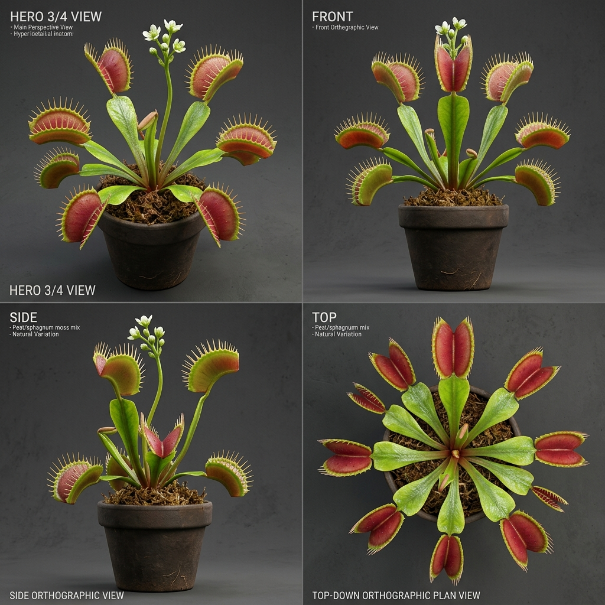

# Đặc Tả Thực Thực Vật 3D: Bẫy Kẹp Venus Răng Cưa (Dionaea muscipula J.Ellis)

> [!NOTE]
> **Mã Định Danh**: `EX02`  
> **Nhóm Hình Thái**: Carnivorous Vines  
> **Hệ Thống Phân Loại (APG IV / Phylogeny)**: Angiosperms > Eudicots > Superasterids > Caryophyllales > Droseraceae  
> **Danh Pháp Khoa Học**: *Dionaea muscipula* J.Ellis  
> **Tên Tiếng Anh**: **Venus Flytrap**  
> **Tầng Sinh Thái**: Cây Bắt Mồi / Đặc Hữu (Carnivorous / Endemic)  
> **Kích Thước Không Gian**: 0.25m (Cao) x 0.35m (Tán) x 3.5cm (Bẫy kẹp)  
> **Mã Cơ Sở Dữ Liệu Đối Chiếu**: POWO: `321332-1` | WFO: `wfo-0000650965` | GBIF: `3190710` | CoL: `36CDQ` | vncreatures: `N/A`  
> **Tình Trạng Bảo Tồn**: IUCN Red List: VU (Vulnerable) | CITES: Appendix II  
> **Phân Bố Tự Nhiên**: Bãi than bùn nghèo đạm ven biển Bắc & Nam Carolina, Hoa Kỳ  
> **Sinh Cảnh Genesis Zero**: Bãi sũng nước nghèo dinh dưỡng ven đầm lầy (Z: 3m - 6m)  
> **Tiêu Chuẩn Đồ Họa**: **Hyper-Realistic Scan-Quality (Blender PBR + SSS)**

---

## Bản Vẽ Thiết Kế 3D Model Sheet (4 Góc Nhìn: Phối Cảnh, Mặt Trước, Mặt Bên, Nhìn Từ Trên)



---

## 1. Giải Phẫu Hình Thái Thực Vật Học (Botanical Anatomy)

### 1.1 Cấu Trúc Tổng Quan
Cụm hoa hình hoa thị sát đất, cuống lá dẹp hình tim mang chiếc bẫy kẹp 2 mảnh hình bán nguyệt úp vào nhau. Viền mép bẫy cắm các răng gai nhọn đan khít vào nhau như chấn song ngục khi bẫy sập.

### 1.2 Chi Tiết Vi Mô & Dấu Ấn Scan (Micro-Geometry & Surface Detail)
Mặt trong lòng bẫy có 3 sợi lông cảm ứng siêu nhạy (trigger hairs), khi con mồi chạm 2 lần trong 20 giây sẽ kích hoạt bẫy sập lại chỉ trong 1/10 giây.

---

## 2. Thông Số Kiến Trúc Lưới 3D (3D Mesh Topology & LODs)

| Thông Số Lưới | Tiêu Chuẩn Scan-Quality | Mô Tả Kỹ Thuật |
|:---|:---|:---|
| **LOD0 (Ultra High)** | **32,000 tris** | Lưới Quads sạch 100%, Manifold kín nước, hỗ trợ Subdivision Surface |
| **LOD1 (Game Engine)** | **7,800 tris** | Tối ưu hóa render thời gian thực, giữ nguyên vẹn Normal Map vi mô |
| **LOD2 (Diorama/Far)** | ~1,200 - 2,500 tris | Dạng Billboard / Low-poly cho góc nhìn viễn cảnh toàn cảnh diorama |
| **Smooth Shading** | `use_smooth = True` | Kích hoạt 100% trên toàn bộ các mặt đa giác, triệt tiêu gãy khúc |
| **UV Unwrapping** | Non-overlapping Island | Tỷ lệ Texel Density đồng đều (2048 px/m), seam giấu khéo léo |

---

## 3. Hệ Thống Vật Liệu Sinh Học PBR (Biological PBR Shader Network)

Vật liệu được xây dựng trên hệ thống Shader chuyên sâu của Blender 5.2.1 LTS:

- **Shader Profile**: `Principled BSDF: Lòng bẫy đỏ hồng tươi tiết mật quyến rũ (#ef4444, SSS 0.65), Vỏ ngoài xanh non (#22c55e), Răng gai nhọn cứng cáp sáp mờ Roughness 0.30.`
- **Subsurface Scattering (SSS)**: Tái hiện chân thực cơ chế ánh sáng đi sâu vào mô tế bào diệp lục và tán xạ ngược ra ngoài khi ngược sáng.
- **Normal & Procedural Displacement**: Tái tạo các khe nứt vỏ cây già cỗi, gờ sống lá, lông tơ nhung và độ cong vi mô của cánh hoa.
- **Color Management**: Tối ưu hóa chuẩn không gian màu **AgX (Medium High Contrast)** cho hình ảnh chân thực và rực rỡ.

---

## 4. Đường Dẫn Tài Nguyên File 3D (Direct Asset Links)

Bạn có thể mở trực tiếp các file 3D của loài thực vật này tại các liên kết sau:

- 🎨 **File Nguồn Blender 3D**: [`carnivorous_venus_flytrap.blend`](../../../assets/flora/carnivorous_vines/carnivorous_venus_flytrap.blend)
- 🚀 **File Xuất Chuẩn Engine glTF/GLB**: [`carnivorous_venus_flytrap.glb`](../../../assets/flora/carnivorous_vines/carnivorous_venus_flytrap.glb)
- 📷 **Bản Vẽ Turnaround 4 Góc**: [`carnivorous_venus_flytrap_turnaround.jpg`](../images/carnivorous_venus_flytrap_turnaround.jpg)
- 🐍 **Mã Nguồn Sinh Hình Học Procedural**: [`flora_builder.py`](../../../assets/flora/generators/flora_builder.py)

---

## 5. Script Nạp Nhanh Vào Scene Hiện Tại (Python Snippet)

```python
import os
import bpy

asset_path = "/Users/duongnad/Documents/project/Genesis_Zero/assets/flora/carnivorous_vines/carnivorous_venus_flytrap.glb"
if os.path.exists(asset_path):
    bpy.ops.import_scene.gltf(filepath=asset_path)
    plant = bpy.context.selected_objects[0]
    plant.name = "Flora_carnivorous_venus_flytrap"
    print(f"✓ Đã đặt {plant.name} vào thế giới Genesis Zero.")
else:
    print(f"Asset file đang được sinh bởi flora_builder.py...")
```
