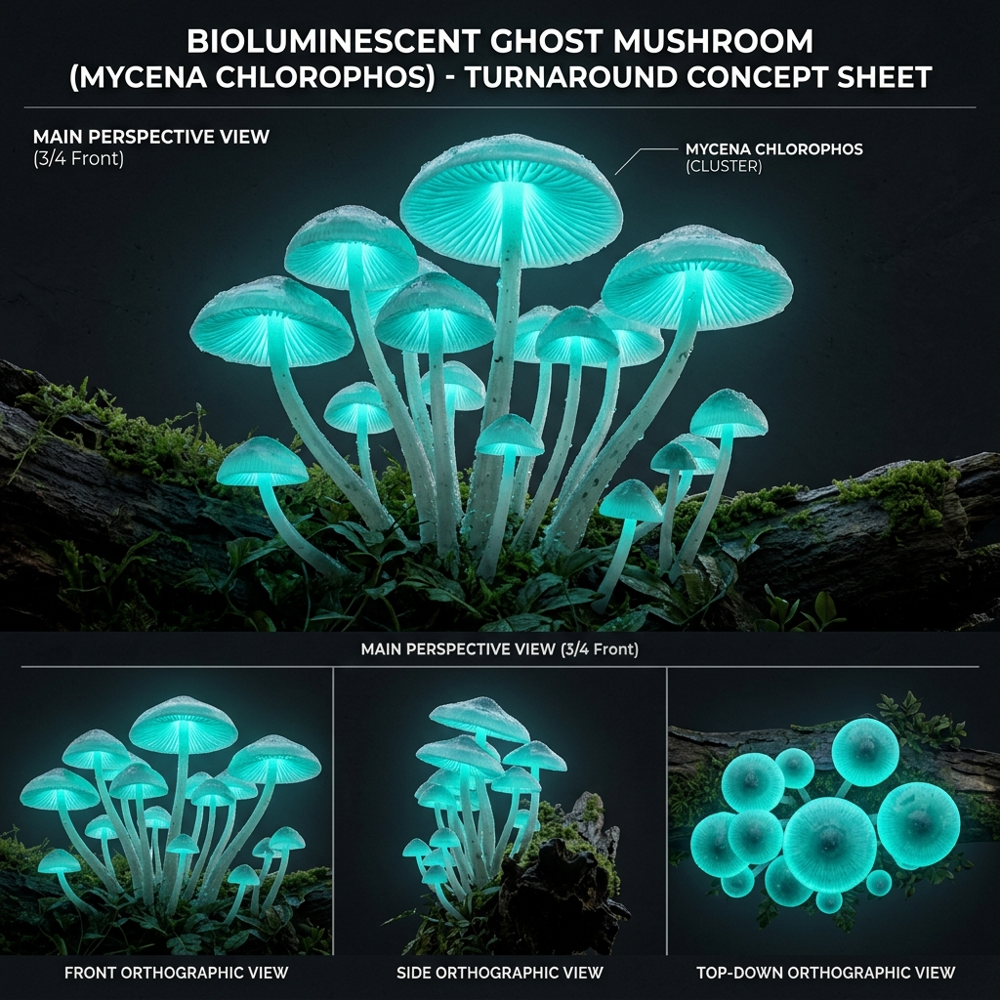

# Đặc Tả Thực Vật 3D: Nấm Mũ Xanh Dạ Quang (Mycena chlorophos)

> [!NOTE]
> **Mã Định Danh**: `EX05`  
> **Nhóm Hình Thái**: Cave Bioluminescent  
> **Hệ Thống Phân Loại (Phylogeny)**: Kingdom Fungi > Basidiomycota > Agaricomycetes > Agaricales > Mycenaceae  
> **Danh Pháp Khoa Học**: *Mycena chlorophos* (Berk. & M.A.Curtis) Sacc.  
> **Tên Tiếng Anh**: **Bioluminescent Ghost Mushroom / Green Pepper Mushroom**  
> **Tầng Sinh Thái**: Hang Động Phát Quang (Cave Bioluminescent)  
> **Kích Thước Không Gian**: 0.85m (Cụm nấm) x 0.95m (Tán) x 30mm (Đường kính mũ nấm)  
> **Mã Cơ Sở Dữ Liệu Đối Chiếu**: IndexFungorum: `198547` | Mycobank: `MB198547` | GBIF: `2527097` | CoL: `44TB3` | vncreatures: Nấm hang bản địa châu Á  
> **Tình Trạng Bảo Tồn**: IUCN Red List: NE (Not Evaluated) | CITES: Không  
> **Phân Bố Tự Nhiên**: Rừng mưa nhiệt đới ẩm Đông & Đông Nam Á (Nhật Bản, Đài Loan, Indonesia)  
> **Sinh Cảnh Genesis Zero**: Lòng hang động ngầm Karst sâu tối, hốc đá vôi ẩm ướt (Z: -7m đến -2m)  
> **Tiêu Chuẩn Đồ Họa**: **Hyper-Realistic Scan-Quality (Blender PBR + SSS)**

---

## Bản Vẽ Thiết Kế 3D Model Sheet (4 Góc Nhìn: Phối Cảnh, Mặt Trước, Mặt Bên, Nhìn Từ Trên)



---


## 1. Giải Phẫu Hình Thái Thực Vật Học (Botanical Anatomy)

### 1.1 Cấu Trúc Tổng Quan
Mọc thành cụm 3-7 cây nấm thân thanh mảnh trên thân gỗ mục trong hang tối. Mũ nấm hình bán cầu xòe rộng, dưới mũ là hệ thống phiến nấm tỏa tia phát ra ánh sáng lục ngọc lam huỳnh quang kỳ ảo.

### 1.2 Chi Tiết Vi Mô & Dấu Ấn Scan (Micro-Geometry & Surface Detail)
Phiến nấm mỏng tang xếp nan hoa tỏa từ cuống ra rìa mũ, mặt trên mũ phủ lớp chất nhầy gelatin trong mờ giúp khuếch tán ánh sáng dạ quang ra không gian xung quanh.

---

## 2. Thông Số Kiến Trúc Lưới 3D (3D Mesh Topology & LODs)

| Thông Số Lưới | Tiêu Chuẩn Scan-Quality | Mô Tả Kỹ Thuật |
|:---|:---|:---|
| **LOD0 (Ultra High)** | **36,000 tris** | Lưới Quads sạch 100%, Manifold kín nước, hỗ trợ Subdivision Surface |
| **LOD1 (Game Engine)** | **8,500 tris** | Tối ưu hóa render thời gian thực, giữ nguyên vẹn Normal Map vi mô |
| **LOD2 (Diorama/Far)** | ~1,200 - 2,500 tris | Dạng Billboard / Low-poly cho góc nhìn viễn cảnh toàn cảnh diorama |
| **Smooth Shading** | `use_smooth = True` | Kích hoạt 100% trên toàn bộ các mặt đa giác, triệt tiêu gãy khúc |
| **UV Unwrapping** | Non-overlapping Island | Tỷ lệ Texel Density đồng đều (2048 px/m), seam giấu khéo léo |

---

## 3. Hệ Thống Vật Liệu Sinh Học PBR (Biological PBR Shader Network)

Vật liệu được xây dựng trên hệ thống Shader chuyên sâu của Blender 5.2.1 LTS:

- **Shader Profile**: `Principled BSDF + Emission Shader: Mũ nấm màu xanh ngọc lam (#06b6d4 / #10b981), Emission Strength: 5.5 lux chiếu sáng rực rỡ bóng đêm hang động, SSS: 0.60 mờ ảo, Cuống nấm trắng mờ trong suốt (#f8fafc).`
- **Subsurface Scattering (SSS)**: Tái hiện chân thực cơ chế ánh sáng đi sâu vào mô tế bào diệp lục và tán xạ ngược ra ngoài khi ngược sáng.
- **Normal & Procedural Displacement**: Tái tạo các khe nứt vỏ cây già cỗi, gờ sống lá, lông tơ nhung và độ cong vi mô của cánh hoa.
- **Color Management**: Tối ưu hóa chuẩn không gian màu **AgX (Medium High Contrast)** cho hình ảnh chân thực và rực rỡ.

---

## 4. Đường Dẫn Tài Nguyên File 3D (Direct Asset Links)

Bạn có thể mở trực tiếp các file 3D của loài thực vật này tại các liên kết sau:

- 🎨 **File Nguồn Blender 3D**: [`cave_bioluminescent_mushroom.blend`](../../../assets/flora/cave_bioluminescent/cave_bioluminescent_mushroom.blend)
- 🚀 **File Xuất Chuẩn Engine glTF/GLB**: [`cave_bioluminescent_mushroom.glb`](../../../assets/flora/cave_bioluminescent/cave_bioluminescent_mushroom.glb)
- 📷 **Bản Vẽ Turnaround 4 Góc**: [`cave_bioluminescent_mushroom_turnaround.jpg`](../images/cave_bioluminescent_mushroom_turnaround.jpg)
- 🐍 **Mã Nguồn Sinh Hình Học Procedural**: [`flora_builder.py`](../../../assets/flora/generators/flora_builder.py)

---

## 5. Script Nạp Nhanh Vào Scene Hiện Tại (Python Snippet)

```python
import os
import bpy

asset_path = "/Users/duongnad/Documents/project/Genesis_Zero/assets/flora/cave_bioluminescent/cave_bioluminescent_mushroom.glb"
if os.path.exists(asset_path):
    bpy.ops.import_scene.gltf(filepath=asset_path)
    plant = bpy.context.selected_objects[0]
    plant.name = "Flora_cave_bioluminescent_mushroom"
    print(f"✓ Đã đặt {plant.name} vào thế giới Genesis Zero.")
else:
    print(f"Asset file đang được sinh bởi flora_builder.py...")
```
