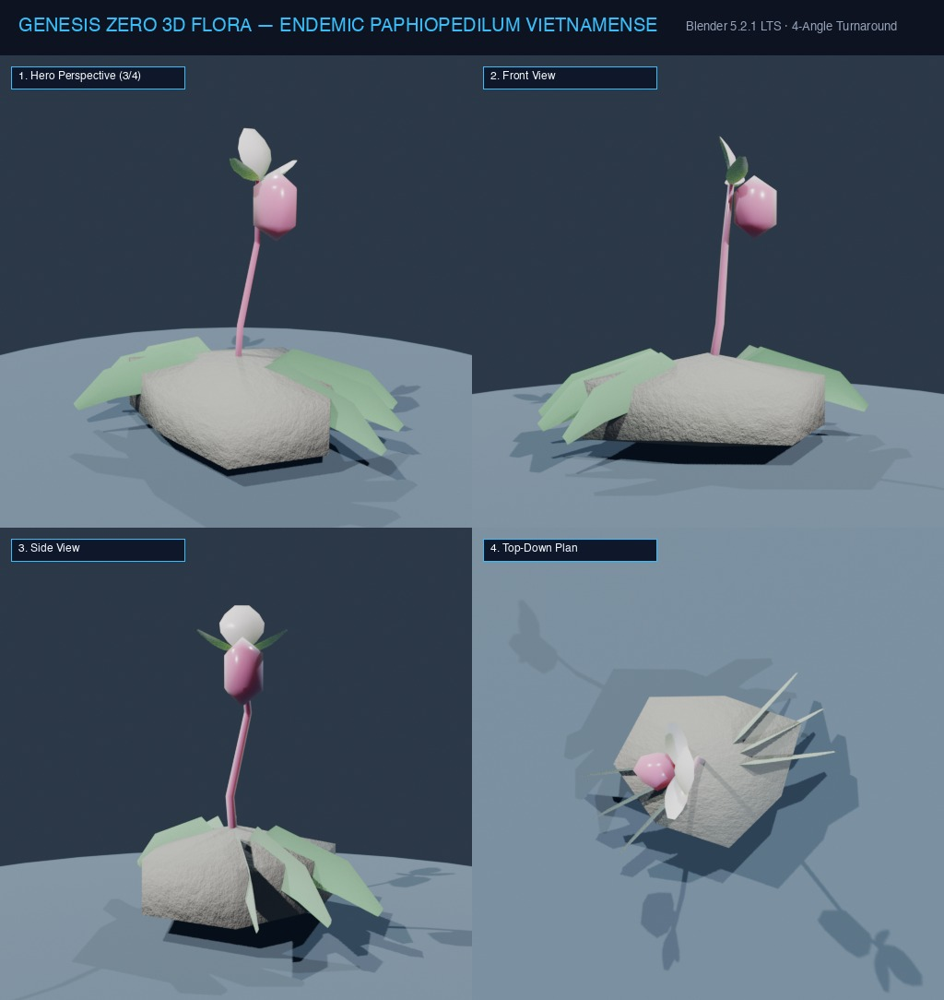

# Đặc Tả Thực Vật 3D: Lan Hài Việt Nam (Paphiopedilum vietnamense)

> [!NOTE]
> **Mã Định Danh**: `ED01`  
> **Nhóm Hình Thái**: Endemic Flora  
> **Hệ Thống Phân Loại (APG IV / Phylogeny)**: Angiosperms > Monocots > Asparagales > Orchidaceae  
> **Danh Pháp Khoa Học**: *Paphiopedilum vietnamense* O.Gruss & Perner  
> **Tên Tiếng Anh**: **Vietnamese Slipper Orchid**  
> **Tầng Sinh Thái**: Cây Đặc Hữu Việt Nam (Endemic Vietnam)  
> **Kích Thước Không Gian**: 0.35m (Cao) x 0.45m (Tán) x 10cm (Đường kính hoa)  
> **Mã Cơ Sở Dữ Liệu Đối Chiếu**: POWO: `1009139-1` | WFO: `wfo-0000262791` | GBIF: `2818985` | CoL: `4CJG8` | vncreatures: `VNC0014`  
> **Tình Trạng Bảo Tồn**: IUCN Red List: CR (Critically Endangered) | CITES: Appendix I | Sách Đỏ Việt Nam: Rất Nguy Cấp  
> **Phân Bố Tự Nhiên**: Vách núi đá vôi cheo leo râm mát tỉnh Cao Bằng, Việt Nam (độ cao 350 - 1400m)  
> **Sinh Cảnh Genesis Zero**: Khe nứt vách đá vôi karst râm mát, độ ẩm cao ven suối ngầm (Z: 3m - 10m)  
> **Tiêu Chuẩn Đồ Họa**: **Hyper-Realistic Scan-Quality (Blender PBR + SSS)**

---
## Bản Vẽ Thiết Kế 3D Model Sheet (4 Góc Nhìn: Phối Cảnh, Mặt Trước, Mặt Bên, Nhìn Từ Trên)

---

## 1. Giải Phẫu Hình Thái Thực Vật Học (Botanical Anatomy)

### 1.1 Cấu Trúc Tổng Quan & Tán Lá (Foliage & Growth Habit)
Cây thân thảo mọc bám trên đá vôi (lithophytic), không có giả hành. Gốc mang 4-6 lá hình bầu dục thon dài 10-18cm, bề mặt trên khảm hoa văn cẩm thạch xanh đậm - xanh nhạt tương phản tuyệt mỹ, mặt dưới lá có đốm tím tía dày đặc ở gốc.

### 1.2 Cành Hoa & Đóa Hoa Lan Hài (Inflorescence & Flower Anatomy)
Ngọn hoa vươn thẳng đứng cao 15-25cm phủ lông tơ nhung màu tím sẫm, mang 1 đóa hoa lớn đường kính 10-12cm. Cánh đài lưng hình trứng màu trắng phớt hồng, hai cánh tràng xòe ngang lượn sóng mềm mại màu hồng cánh sen pha tím. Cánh môi biến dạng thành dạng hài (pouch/slipper) phồng to hình trứng ngược màu hồng tím đậm với mép cuộn vào trong, dẫn dụ côn trùng thụ phấn.

### 1.3 Chi Tiết Vi Mô & Dấu Ấn Scan (Micro-Geometry & Surface Detail)
Toàn bộ cuống hoa và bầu noãn phủ lớp lông tuyến mịn dày đặc. Bề mặt cánh môi có các đường gân chìm mạng lưới và lớp biểu bì mờ phản quang sáp hữu cơ, nhị lép hình khiên lớn màu vàng chanh viền tím ở tâm hoa.

---

## 2. Thông Số Kiến Trúc Lưới 3D (3D Mesh Topology & LODs)

| Thông Số Lưới | Tiêu Chuẩn Scan-Quality | Mô Tả Kỹ Thuật |
|:---|:---|:---|
| **LOD0 (Ultra High)** | **32,000 tris** | Lưới Quads sạch 100%, Manifold kín nước, hỗ trợ Subdivision Surface |
| **LOD1 (Game Engine)** | **7,500 tris** | Tối ưu hóa render thời gian thực, giữ nguyên vẹn Normal Map vi mô |
| **LOD2 (Diorama/Far)** | ~1,200 - 2,500 tris | Dạng Billboard / Low-poly cho góc nhìn viễn cảnh toàn cảnh diorama |
| **Smooth Shading** | `use_smooth = True` | Kích hoạt 100% trên toàn bộ các mặt đa giác, triệt tiêu gãy khúc |
| **UV Unwrapping** | Non-overlapping Island | Tỷ lệ Texel Density đồng đều (2048 px/m), seam giấu khéo léo |

---

## 3. Hệ Thống Vật Liệu Sinh Học PBR (Biological PBR Shader Network)

Vật liệu được xây dựng trên hệ thống Shader chuyên sâu của Blender 5.2.1 LTS:

- **Shader Profile**: `Principled BSDF Multi-Material: Cánh hoa hồng tím SSS cao (#e879f9 đến #c026d3), Cánh môi dạng hài bóng nhẹ Roughness 0.25, Phiến lá hoa văn cẩm thạch (#15803d pha #86efac), Cuống phủ lông nhung Bump Micro-Noise.`
- **Subsurface Scattering (SSS)**: Cánh hoa thấu quang mạnh (Weight: 0.65, Radius: (0.45, 0.15, 0.25)), cánh môi hài thấu quang dịu.
- **Procedural Displacement**: Vân cẩm thạch trên lá và gân cánh môi uốn lượn tự nhiên.
- **Color Management**: Chuẩn không gian màu **AgX (Medium High Contrast)**.

---

## 4. Đường Dẫn Tài Nguyên File 3D (Direct Asset Links)

- 🎨 **Tài Liệu Chi Tiết Master Catalog**: [`docs/flora/README.md`](../README.md)
- 🌐 **Trình Xem Thực Vật 3D Web**: [`flora_viewer.html`](../../../web/flora_viewer.html)
- 🐍 **Mã Nguồn Sinh Hình Học Procedural**: [`flora_builder.py`](../../../assets/flora/generators/flora_builder.py)
