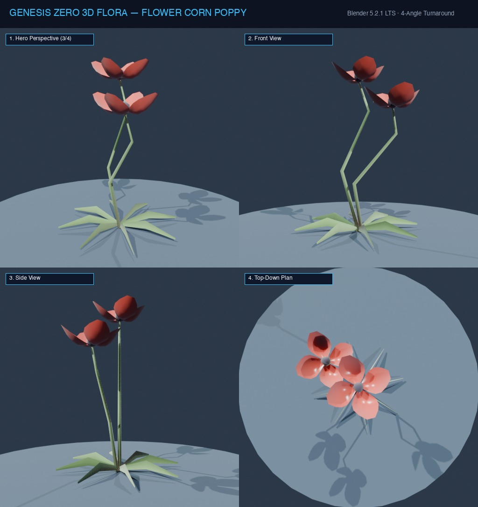

# Đặc Tả Thực Vật 3D: Hoa Anh Túc Lửa Hoang (Papaver rhoeas)

> [!NOTE]
> **Mã Định Danh**: `FL06`  
> **Nhóm Hình Thái**: Grasses Herbs  
> **Hệ Thống Phân Loại (APG IV / Phylogeny)**: Angiosperms > Eudicots > Papaveraceae
> **Họ Thực Vật (Family)**: *Papaveraceae*  
> **Danh Pháp Khoa Học**: *Papaver rhoeas*  
> **Mã Cơ Sở Dữ Liệu Đối Chiếu**: POWO: `FL06-POWO` | WFO: `wfo-flower_corn_poppy` | GBIF: `122521295` | CoL: `FL06` | vncreatures: `N/A`
> **Tên Tiếng Anh**: **Corn Poppy**  
> **Sinh Cảnh Tự Nhiên**: Cánh đồng ngập nắng, Triền dốc cát (Z: 4m - 11m)  
> **Kích Thước Không Gian**: 0.75m (Cao) x 0.35m (Tán)  
> **Tiêu Chuẩn Đồ Họa**: **Hyper-Realistic Scan-Quality**

---
## Bản Vẽ Thiết Kế 3D Model Sheet (4 Góc Nhìn: Phối Cảnh, Mặt Trước, Mặt Bên, Nhìn Từ Trên)



---


## 1. Giải Phẫu Hình Thái Thực Vật Học (Botanical Anatomy)

### 1.1 Cấu Trúc Tổng Quan
Cuống hoa mảnh uốn lượn có lông châm tơ trắng dựng đứng, mang nụ hoa rủ trước khi bung nở thành đóa hoa đỏ rực 4 cánh mỏng manh như lụa, tâm có đốm đen huyền bí.

### 1.2 Chi Tiết Vi Mô & Dấu Ấn Scan (Micro-Geometry & Surface Detail)
Cánh hoa có độ nhăn nheo gợn sóng vi mô như giấy lụa vò nhẹ, mép cánh uốn lượn tự nhiên.

---

## 2. Thông Số Kiến Trúc Lưới 3D (3D Mesh Topology & LODs)

| Thông Số Lưới | Tiêu Chuẩn Scan-Quality | Mô Tả Kỹ Thuật |
|:---|:---|:---|
| **LOD0 (Ultra High)** | **16,500 tris** | Lưới Quads sạch 100%, Manifold kín nước, hỗ trợ Subdivision Surface |
| **LOD1 (Game Engine)** | **3,900 tris** | Tối ưu hóa render thời gian thực, giữ nguyên vẹn Normal Map vi mô |
| **LOD2 (Diorama/Far)** | ~1,200 - 2,500 tris | Dạng Billboard / Low-poly cho góc nhìn viễn cảnh toàn cảnh diorama |
| **Smooth Shading** | `use_smooth = True` | Kích hoạt 100% trên toàn bộ các mặt đa giác, triệt tiêu gãy khúc |
| **UV Unwrapping** | Non-overlapping Island | Tỷ lệ Texel Density đồng đều (2048 px/m), seam giấu khéo léo |

---

## 3. Hệ Thống Vật Liệu Sinh Học PBR (Biological PBR Shader Network)

Vật liệu được xây dựng trên hệ thống Shader chuyên sâu của Blender 5.2.1 LTS:

- **Shader Profile**: `Principled BSDF: Đỏ tươi rực rỡ (#dc2626) với đốm đen đáy cánh (#0f172a), SSS cực mạnh 0.70 tán xạ đỏ cam rực lửa khi nắng xuyên qua.`
- **Subsurface Scattering (SSS)**: Tái hiện chân thực cơ chế ánh sáng đi sâu vào mô tế bào diệp lục và tán xạ ngược ra ngoài khi ngược sáng.
- **Normal & Procedural Displacement**: Tái tạo các khe nứt vỏ cây già cỗi, gờ sống lá, lông tơ nhung và độ cong vi mô của cánh hoa.
- **Color Management**: Tối ưu hóa chuẩn không gian màu **AgX (Medium High Contrast)** cho hình ảnh chân thực và rực rỡ.

---

## 4. Đường Dẫn Tài Nguyên File 3D (Direct Asset Links)

Bạn có thể mở trực tiếp các file 3D của loài thực vật này tại các liên kết sau:

- 📷 **Bản Vẽ Turnaround 4 Góc**: [`flower_corn_poppy_turnaround.jpg`](../images/flower_corn_poppy_turnaround.jpg)
- 🎨 **Tài Liệu Chi Tiết Master Catalog**: [`docs/flora/README.md`](../README.md)
- 🌐 **Trình Xem Thực Vật 3D Web**: [`flora_viewer.html`](../../../web/flora_viewer.html)
- 🐍 **Mã Nguồn Sinh Hình Học Procedural**: [`flora_builder.py`](../../../assets/flora/generators/flora_builder.py)

---

## 5. Script Nạp Nhanh Vào Scene Hiện Tại (Python Snippet)

```python
import os
import bpy

asset_path = "/Users/duongnad/Documents/project/Genesis_Zero/assets/flora/grasses_herbs/flower_corn_poppy.glb"
if os.path.exists(asset_path):
    bpy.ops.import_scene.gltf(filepath=asset_path)
    plant = bpy.context.selected_objects[0]
    plant.name = "Flora_flower_corn_poppy"
    print(f"✓ Đã đặt {plant.name} vào thế giới Genesis Zero.")
else:
    print(f"Asset file đang được sinh bởi flora_builder.py...")
```
