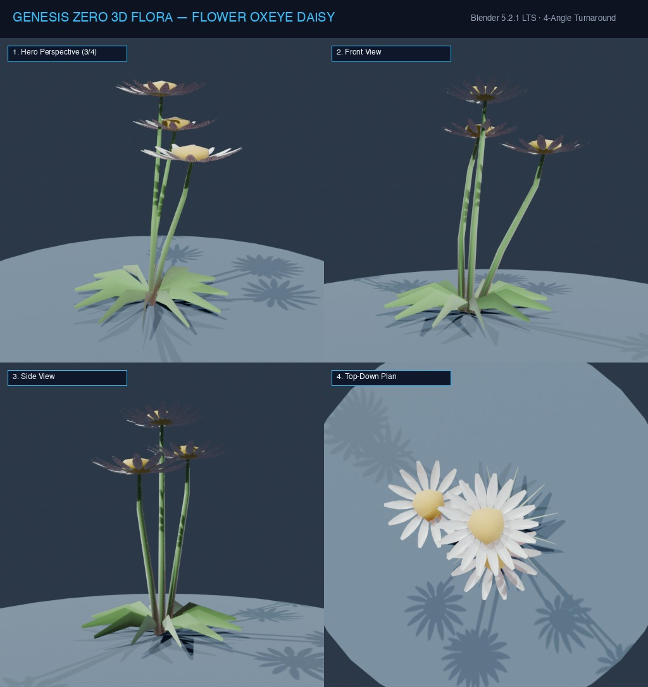

# Đặc Tả Thực Vật 3D: Cúc Vàng Đồng Nội (Leucanthemum vulgare Lam.)

> [!NOTE]
> **Mã Định Danh**: `FL01`  
> **Nhóm Hình Thái**: Grasses Herbs  
> **Hệ Thống Phân Loại (APG IV / Phylogeny)**: Angiosperms > Eudicots > Asterids > Asterales > Asteraceae  
> **Danh Pháp Khoa Học**: *Leucanthemum vulgare* Lam.  
> **Tên Tiếng Anh**: **Oxeye Daisy / Dog Daisy**  
> **Tầng Sinh Thái**: Thảo Mộc & Hoa Dại (Herbs & Wildflowers)  
> **Kích Thước Không Gian**: 0.65m (Cao) x 0.4m (Tán) x 5cm (Đường kính hoa)  
> **Mã Cơ Sở Dữ Liệu Đối Chiếu**: POWO: `230006-1` | WFO: `wfo-0000078028` | GBIF: `3142270` | CoL: `3TB6F` | vncreatures: `N/A`  
> **Tình Trạng Bảo Tồn**: IUCN Red List: LC (Least Concern) | CITES: Không  
> **Phân Bố Tự Nhiên**: Đồng cỏ ngập nắng, thung lũng ven suối châu Âu & vùng ôn đới  
> **Sinh Cảnh Genesis Zero**: Thung lũng đồng bằng ven suối, triền cỏ đón nắng (Z: 4m - 9m)  
> **Tiêu Chuẩn Đồ Họa**: **Hyper-Realistic Scan-Quality (Blender PBR + SSS)**

---
## Bản Vẽ Thiết Kế 3D Model Sheet (4 Góc Nhìn: Phối Cảnh, Mặt Trước, Mặt Bên, Nhìn Từ Trên)



---


## 1. Giải Phẫu Hình Thái Thực Vật Học (Botanical Anatomy)

### 1.1 Cấu Trúc Tổng Quan
Thân đứng có khía dọc, lá xẻ thùy răng cưa thưa. Đóa hoa đơn độc ở đỉnh với đĩa nhụy hoa vàng cam hình vòm lõm chứa hàng trăm hoa ống li ti, viền ngoài là 20-30 cánh hoa trắng muốt thuôn dài.

### 1.2 Chi Tiết Vi Mô & Dấu Ấn Scan (Micro-Geometry & Surface Detail)
Mặt đĩa nhụy xếp xoắn ốc theo tỷ lệ vàng Fibonacci (34/55 spirals), từng nụ hoa ống có viền cánh 5 cánh siêu nhỏ. Cánh hoa có gân chìm uốn lượn.

---

## 2. Thông Số Kiến Trúc Lưới 3D (3D Mesh Topology & LODs)

| Thông Số Lưới | Tiêu Chuẩn Scan-Quality | Mô Tả Kỹ Thuật |
|:---|:---|:---|
| **LOD0 (Ultra High)** | **24,000 tris** | Lưới Quads sạch 100%, Manifold kín nước, hỗ trợ Subdivision Surface |
| **LOD1 (Game Engine)** | **5,800 tris** | Tối ưu hóa render thời gian thực, giữ nguyên vẹn Normal Map vi mô |
| **LOD2 (Diorama/Far)** | ~1,200 - 2,500 tris | Dạng Billboard / Low-poly cho góc nhìn viễn cảnh toàn cảnh diorama |
| **Smooth Shading** | `use_smooth = True` | Kích hoạt 100% trên toàn bộ các mặt đa giác, triệt tiêu gãy khúc |
| **UV Unwrapping** | Non-overlapping Island | Tỷ lệ Texel Density đồng đều (2048 px/m), seam giấu khéo léo |

---

## 3. Hệ Thống Vật Liệu Sinh Học PBR (Biological PBR Shader Network)

Vật liệu được xây dựng trên hệ thống Shader chuyên sâu của Blender 5.2.1 LTS:

- **Shader Profile**: `Principled BSDF: Cánh hoa trắng sứ (#ffffff) SSS 0.45 với bán kính tán xạ vàng nhạt. Nhụy hoa vàng nghệ đậm (#f59e0b) Roughness 0.90 mô phỏng phấn hoa mịn màng.`
- **Subsurface Scattering (SSS)**: Tái hiện chân thực cơ chế ánh sáng đi sâu vào mô tế bào diệp lục và tán xạ ngược ra ngoài khi ngược sáng.
- **Normal & Procedural Displacement**: Tái tạo các khe nứt vỏ cây già cỗi, gờ sống lá, lông tơ nhung và độ cong vi mô của cánh hoa.
- **Color Management**: Tối ưu hóa chuẩn không gian màu **AgX (Medium High Contrast)** cho hình ảnh chân thực và rực rỡ.

---

## 4. Đường Dẫn Tài Nguyên File 3D (Direct Asset Links)

Bạn có thể mở trực tiếp các file 3D của loài thực vật này tại các liên kết sau:

- 📷 **Bản Vẽ Turnaround 4 Góc**: [`flower_oxeye_daisy_turnaround.jpg`](../images/flower_oxeye_daisy_turnaround.jpg)
- 🎨 **Tài Liệu Chi Tiết Master Catalog**: [`docs/flora/README.md`](../README.md)
- 🌐 **Trình Xem Thực Vật 3D Web**: [`flora_viewer.html`](../../../web/flora_viewer.html)
- 🐍 **Mã Nguồn Sinh Hình Học Procedural**: [`flora_builder.py`](../../../assets/flora/generators/flora_builder.py)

---

## 5. Script Nạp Nhanh Vào Scene Hiện Tại (Python Snippet)

```python
import os
import bpy

asset_path = "/Users/duongnad/Documents/project/Genesis_Zero/assets/flora/grasses_herbs/flower_oxeye_daisy.glb"
if os.path.exists(asset_path):
    bpy.ops.import_scene.gltf(filepath=asset_path)
    plant = bpy.context.selected_objects[0]
    plant.name = "Flora_flower_oxeye_daisy"
    print(f"✓ Đã đặt {plant.name} vào thế giới Genesis Zero.")
else:
    print(f"Asset file đang được sinh bởi flora_builder.py...")
```
