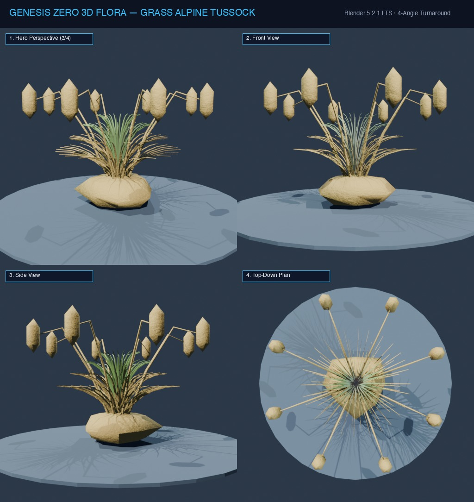

# Đặc Tả Thực Vật 3D: Cỏ Tussock Núi Cao (Chionochloa rigida (Raoul) Zotov)

> [!NOTE]
> **Mã Định Danh**: `GR02`  
> **Nhóm Hình Thái**: Grasses Herbs  
> **Hệ Thống Phân Loại (APG IV / Phylogeny)**: Angiosperms > Monocots > Commelinids > Poales > Poaceae  
> **Danh Pháp Khoa Học**: *Chionochloa rigida* (Raoul) Zotov  
> **Tên Tiếng Anh**: **Alpine Tussock Grass**  
> **Tầng Sinh Thái**: Cỏ Núi Cao / Thảm Phủ (Alpine Grass)  
> **Kích Thước Không Gian**: 0.85m (Cao) x 0.75m (Tán)  
> **Mã Cơ Sở Dữ Liệu Đối Chiếu**: POWO: `395462-1` | WFO: `wfo-0000892015` | GBIF: `2703874` | CoL: `5Y5F3` | vncreatures: `N/A`  
> **Tình Trạng Bảo Tồn**: IUCN Red List: LC (Least Concern) | CITES: Không  
> **Phân Bố Tự Nhiên**: Đồng cỏ núi cao, đỉnh núi băng giá New Zealand & vùng ôn đới lạnh  
> **Sinh Cảnh Genesis Zero**: Đỉnh núi tuyết, Khô lạnh gió rét (Z: 12m - 20m)  
> **Tiêu Chuẩn Đồ Họa**: **Hyper-Realistic Scan-Quality (Blender PBR + SSS)**

---
## Bản Vẽ Thiết Kế 3D Model Sheet (4 Góc Nhìn: Phối Cảnh, Mặt Trước, Mặt Bên, Nhìn Từ Trên)



---


## 1. Giải Phẫu Hình Thái Thực Vật Học (Botanical Anatomy)

### 1.1 Cấu Trúc Tổng Quan
Búi cỏ vòm tròn hình cầu rậm rạp, các dải lá già khô vàng rơm uốn rủ bao bọc chân gốc tạo lớp cách nhiệt chống băng giá, lõi giữa vươn các ngọn cỏ xanh xám cứng cáp.

### 1.2 Chi Tiết Vi Mô & Dấu Ấn Scan (Micro-Geometry & Surface Detail)
Lá dày cứng có gân sống lưng nổi rõ, bề mặt phủ lớp sáp cutin mờ kháng nước, mép lá sắc cạnh có răng cưa li ti bám tuyết.

---

## 2. Thông Số Kiến Trúc Lưới 3D (3D Mesh Topology & LODs)

| Thông Số Lưới | Tiêu Chuẩn Scan-Quality | Mô Tả Kỹ Thuật |
|:---|:---|:---|
| **LOD0 (Ultra High)** | **26,500 tris** | Lưới Quads sạch 100%, Manifold kín nước, hỗ trợ Subdivision Surface |
| **LOD1 (Game Engine)** | **6,800 tris** | Tối ưu hóa render thời gian thực, giữ nguyên vẹn Normal Map vi mô |
| **LOD2 (Diorama/Far)** | ~1,200 - 2,500 tris | Dạng Billboard / Low-poly cho góc nhìn viễn cảnh toàn cảnh diorama |
| **Smooth Shading** | `use_smooth = True` | Kích hoạt 100% trên toàn bộ các mặt đa giác, triệt tiêu gãy khúc |
| **UV Unwrapping** | Non-overlapping Island | Tỷ lệ Texel Density đồng đều (2048 px/m), seam giấu khéo léo |

---

## 3. Hệ Thống Vật Liệu Sinh Học PBR (Biological PBR Shader Network)

Vật liệu được xây dựng trên hệ thống Shader chuyên sâu của Blender 5.2.1 LTS:

- **Shader Profile**: `Principled BSDF: Dual-zone material. Vỏ ngoài màu vàng rơm (#ca8a04, Roughness 0.75), Lõi trong xanh xám tro (#65a30d, Roughness 0.50), SSS mỏng 0.15 chống chói sáng tuyết.`
- **Subsurface Scattering (SSS)**: Tái hiện chân thực cơ chế ánh sáng đi sâu vào mô tế bào diệp lục và tán xạ ngược ra ngoài khi ngược sáng.
- **Normal & Procedural Displacement**: Tái tạo các khe nứt vỏ cây già cỗi, gờ sống lá, lông tơ nhung và độ cong vi mô của cánh hoa.
- **Color Management**: Tối ưu hóa chuẩn không gian màu **AgX (Medium High Contrast)** cho hình ảnh chân thực và rực rỡ.

---

## 4. Đường Dẫn Tài Nguyên File 3D (Direct Asset Links)

Bạn có thể mở trực tiếp các file 3D của loài thực vật này tại các liên kết sau:

- 📷 **Bản Vẽ Turnaround 4 Góc**: [`grass_alpine_tussock_turnaround.jpg`](../images/grass_alpine_tussock_turnaround.jpg)
- 🎨 **File Nguồn Blender 3D**: [`grass_alpine_tussock.blend`](../../../assets/flora/grasses_herbs/grass_alpine_tussock.blend)
- 🚀 **File Xuất Chuẩn Engine glTF/GLB**: [`grass_alpine_tussock.glb`](../../../assets/flora/grasses_herbs/grass_alpine_tussock.glb)
- 🐍 **Mã Nguồn Sinh Hình Học Procedural**: [`flora_builder.py`](../../../assets/flora/generators/flora_builder.py)

---

## 5. Script Nạp Nhanh Vào Scene Hiện Tại (Python Snippet)

```python
import os
import bpy

asset_path = "/Users/duongnad/Documents/project/Genesis_Zero/assets/flora/grasses_herbs/grass_alpine_tussock.glb"
if os.path.exists(asset_path):
    bpy.ops.import_scene.gltf(filepath=asset_path)
    plant = bpy.context.selected_objects[0]
    plant.name = "Flora_grass_alpine_tussock"
    print(f"✓ Đã đặt {plant.name} vào thế giới Genesis Zero.")
else:
    print(f"Asset file đang được sinh bởi flora_builder.py...")
```
