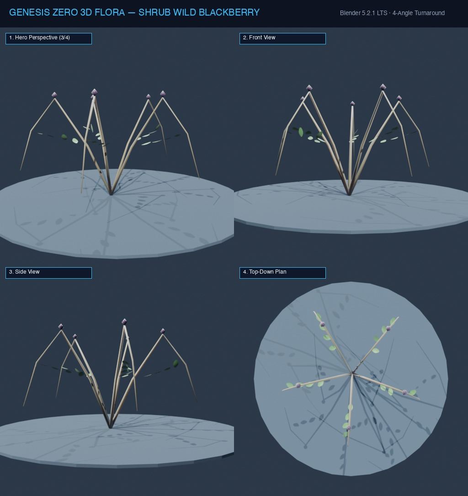

# Đặc Tả Thực Vật 3D: Cây Dâu Rừng Gai Đen (Rubus fruticosus)

> [!NOTE]
> **Mã Định Danh**: `SH10`  
> **Nhóm Hình Thái**: Understory Shrubs  
> **Hệ Thống Phân Loại (APG IV / Phylogeny)**: Angiosperms > Eudicots > Rosaceae
> **Họ Thực Vật (Family)**: *Rosaceae*  
> **Danh Pháp Khoa Học**: *Rubus fruticosus*  
> **Mã Cơ Sở Dữ Liệu Đối Chiếu**: POWO: `SH10-POWO` | WFO: `wfo-shrub_wild_blackberry` | GBIF: `101211749` | CoL: `SH10` | vncreatures: `N/A`
> **Tên Tiếng Anh**: **Wild Blackberry Bush**  
> **Sinh Cảnh Tự Nhiên**: Bìa rừng, Hàng rào đá, Bụi gai rậm (Z: 3m - 8m)  
> **Kích Thước Không Gian**: 1.8m (Cao) x 2.2m (Tán gai)  
> **Tiêu Chuẩn Đồ Họa**: **Hyper-Realistic Scan-Quality**

---
## Bản Vẽ Thiết Kế 3D Model Sheet (4 Góc Nhìn: Phối Cảnh, Mặt Trước, Mặt Bên, Nhìn Từ Trên)



---


## 1. Giải Phẫu Hình Thái Thực Vật Học (Botanical Anatomy)

### 1.1 Cấu Trúc Tổng Quan
Cành nhánh dạng cung vươn dài chằng chịt vũ trang bằng vô số gai móc câu sắc nhọn. Chùm quả mọng chuyển từ xanh sang đỏ và đen bóng căng mọng khi chín.

### 1.2 Chi Tiết Vi Mô & Dấu Ấn Scan (Micro-Geometry & Surface Detail)
Quả tụ cấu tạo từ 20-30 quả hạch nhỏ li ti ghép lại, từng hạt mọng có một sợi râu tơ ở đỉnh.

---

## 2. Thông Số Kiến Trúc Lưới 3D (3D Mesh Topology & LODs)

| Thông Số Lưới | Tiêu Chuẩn Scan-Quality | Mô Tả Kỹ Thuật |
|:---|:---|:---|
| **LOD0 (Ultra High)** | **46,000 tris** | Lưới Quads sạch 100%, Manifold kín nước, hỗ trợ Subdivision Surface |
| **LOD1 (Game Engine)** | **11,200 tris** | Tối ưu hóa render thời gian thực, giữ nguyên vẹn Normal Map vi mô |
| **LOD2 (Diorama/Far)** | ~1,200 - 2,500 tris | Dạng Billboard / Low-poly cho góc nhìn viễn cảnh toàn cảnh diorama |
| **Smooth Shading** | `use_smooth = True` | Kích hoạt 100% trên toàn bộ các mặt đa giác, triệt tiêu gãy khúc |
| **UV Unwrapping** | Non-overlapping Island | Tỷ lệ Texel Density đồng đều (2048 px/m), seam giấu khéo léo |

---

## 3. Hệ Thống Vật Liệu Sinh Học PBR (Biological PBR Shader Network)

Vật liệu được xây dựng trên hệ thống Shader chuyên sâu của Blender 5.2.1 LTS:

- **Shader Profile**: `Principled BSDF: Quả đen bóng (#0f172a, Clearcoat 0.60, Roughness 0.15, SSS 0.40), Gai móc đỏ hung nhọn hoắt (#991b1b).`
- **Subsurface Scattering (SSS)**: Tái hiện chân thực cơ chế ánh sáng đi sâu vào mô tế bào diệp lục và tán xạ ngược ra ngoài khi ngược sáng.
- **Normal & Procedural Displacement**: Tái tạo các khe nứt vỏ cây già cỗi, gờ sống lá, lông tơ nhung và độ cong vi mô của cánh hoa.
- **Color Management**: Tối ưu hóa chuẩn không gian màu **AgX (Medium High Contrast)** cho hình ảnh chân thực và rực rỡ.

---

## 4. Đường Dẫn Tài Nguyên File 3D (Direct Asset Links)

Bạn có thể mở trực tiếp các file 3D của loài thực vật này tại các liên kết sau:

- 📷 **Bản Vẽ Turnaround 4 Góc**: [`shrub_wild_blackberry_turnaround.jpg`](../images/shrub_wild_blackberry_turnaround.jpg)
- 🎨 **Tài Liệu Chi Tiết Master Catalog**: [`docs/flora/README.md`](../README.md)
- 🌐 **Trình Xem Thực Vật 3D Web**: [`flora_viewer.html`](../../../web/flora_viewer.html)
- 🐍 **Mã Nguồn Sinh Hình Học Procedural**: [`flora_builder.py`](../../../assets/flora/generators/flora_builder.py)

---

## 5. Script Nạp Nhanh Vào Scene Hiện Tại (Python Snippet)

```python
import os
import bpy

asset_path = "/Users/duongnad/Documents/project/Genesis_Zero/assets/flora/understory_shrubs/shrub_wild_blackberry.glb"
if os.path.exists(asset_path):
    bpy.ops.import_scene.gltf(filepath=asset_path)
    plant = bpy.context.selected_objects[0]
    plant.name = "Flora_shrub_wild_blackberry"
    print(f"✓ Đã đặt {plant.name} vào thế giới Genesis Zero.")
else:
    print(f"Asset file đang được sinh bởi flora_builder.py...")
```
