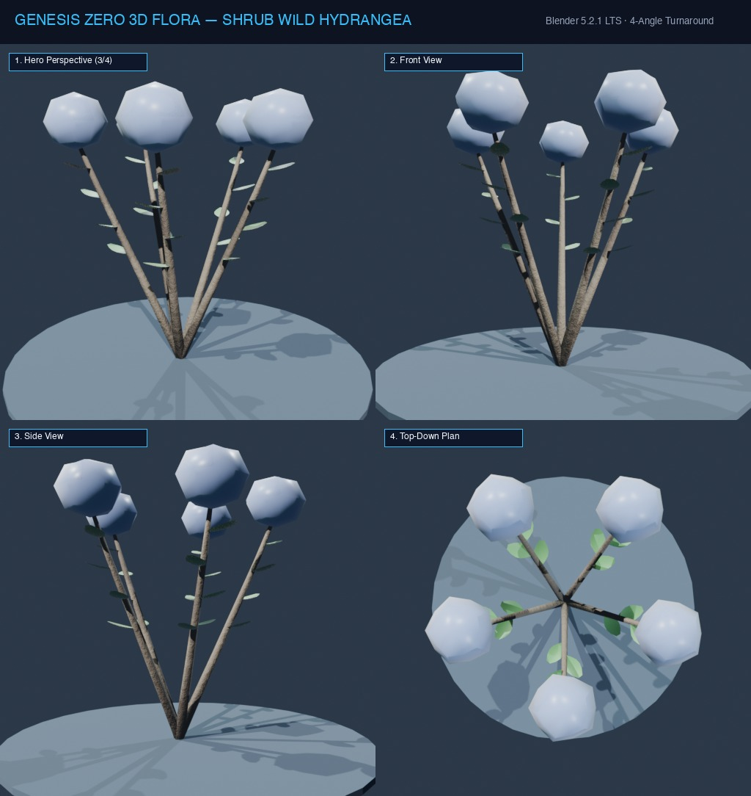

# Đặc Tả Thực Vật 3D: Bụi Cẩm Tú Cầu Rừng (Hydrangea macrophylla)

> [!NOTE]
> **Mã Định Danh**: `SH09`  
> **Nhóm Hình Thái**: Understory Shrubs  
> **Hệ Thống Phân Loại (APG IV / Phylogeny)**: Angiosperms > Eudicots > Hydrangeaceae
> **Họ Thực Vật (Family)**: *Hydrangeaceae*  
> **Danh Pháp Khoa Học**: *Hydrangea macrophylla*  
> **Mã Cơ Sở Dữ Liệu Đối Chiếu**: POWO: `SH09-POWO` | WFO: `wfo-shrub_wild_hydrangea` | GBIF: `15857355` | CoL: `SH09` | vncreatures: `N/A`
> **Tên Tiếng Anh**: **Wild Forest Hydrangea**  
> **Sinh Cảnh Tự Nhiên**: Khe núi suối ẩm, Tán rừng thưa (Z: 4m - 9m)  
> **Kích Thước Không Gian**: 1.6m (Cao) x 1.8m (Tán tròn)  
> **Tiêu Chuẩn Đồ Họa**: **Hyper-Realistic Scan-Quality**

---
## Bản Vẽ Thiết Kế 3D Model Sheet (4 Góc Nhìn: Phối Cảnh, Mặt Trước, Mặt Bên, Nhìn Từ Trên)



---


## 1. Giải Phẫu Hình Thái Thực Vật Học (Botanical Anatomy)

### 1.1 Cấu Trúc Tổng Quan
Bụi cây tán tròn rậm rạp mang những quả cầu hoa khổng lồ đường kính 25cm chuyển sắc kỳ ảo giữa xanh lam, tím thạch anh và hồng phấn tùy độ phèn đất.

### 1.2 Chi Tiết Vi Mô & Dấu Ấn Scan (Micro-Geometry & Surface Detail)
Quả cầu hoa cấu thành từ hàng trăm đóa hoa 4 cánh nhỏ vô tính xếp lợp ngói tỉ mỉ.

---

## 2. Thông Số Kiến Trúc Lưới 3D (3D Mesh Topology & LODs)

| Thông Số Lưới | Tiêu Chuẩn Scan-Quality | Mô Tả Kỹ Thuật |
|:---|:---|:---|
| **LOD0 (Ultra High)** | **48,000 tris** | Lưới Quads sạch 100%, Manifold kín nước, hỗ trợ Subdivision Surface |
| **LOD1 (Game Engine)** | **11,800 tris** | Tối ưu hóa render thời gian thực, giữ nguyên vẹn Normal Map vi mô |
| **LOD2 (Diorama/Far)** | ~1,200 - 2,500 tris | Dạng Billboard / Low-poly cho góc nhìn viễn cảnh toàn cảnh diorama |
| **Smooth Shading** | `use_smooth = True` | Kích hoạt 100% trên toàn bộ các mặt đa giác, triệt tiêu gãy khúc |
| **UV Unwrapping** | Non-overlapping Island | Tỷ lệ Texel Density đồng đều (2048 px/m), seam giấu khéo léo |

---

## 3. Hệ Thống Vật Liệu Sinh Học PBR (Biological PBR Shader Network)

Vật liệu được xây dựng trên hệ thống Shader chuyên sâu của Blender 5.2.1 LTS:

- **Shader Profile**: `Principled BSDF: Chuyển sắc ombre xanh lam tím (#3b82f6 / #a855f7), SSS: 0.55 mờ ảo, Lá xanh thẫm có răng cưa lớn.`
- **Subsurface Scattering (SSS)**: Tái hiện chân thực cơ chế ánh sáng đi sâu vào mô tế bào diệp lục và tán xạ ngược ra ngoài khi ngược sáng.
- **Normal & Procedural Displacement**: Tái tạo các khe nứt vỏ cây già cỗi, gờ sống lá, lông tơ nhung và độ cong vi mô của cánh hoa.
- **Color Management**: Tối ưu hóa chuẩn không gian màu **AgX (Medium High Contrast)** cho hình ảnh chân thực và rực rỡ.

---

## 4. Đường Dẫn Tài Nguyên File 3D (Direct Asset Links)

Bạn có thể mở trực tiếp các file 3D của loài thực vật này tại các liên kết sau:

- 📷 **Bản Vẽ Turnaround 4 Góc**: [`shrub_wild_hydrangea_turnaround.jpg`](../images/shrub_wild_hydrangea_turnaround.jpg)
- 🎨 **Tài Liệu Chi Tiết Master Catalog**: [`docs/flora/README.md`](../README.md)
- 🌐 **Trình Xem Thực Vật 3D Web**: [`flora_viewer.html`](../../../web/flora_viewer.html)
- 🐍 **Mã Nguồn Sinh Hình Học Procedural**: [`flora_builder.py`](../../../assets/flora/generators/flora_builder.py)

---

## 5. Script Nạp Nhanh Vào Scene Hiện Tại (Python Snippet)

```python
import os
import bpy

asset_path = "/Users/duongnad/Documents/project/Genesis_Zero/assets/flora/understory_shrubs/shrub_wild_hydrangea.glb"
if os.path.exists(asset_path):
    bpy.ops.import_scene.gltf(filepath=asset_path)
    plant = bpy.context.selected_objects[0]
    plant.name = "Flora_shrub_wild_hydrangea"
    print(f"✓ Đã đặt {plant.name} vào thế giới Genesis Zero.")
else:
    print(f"Asset file đang được sinh bởi flora_builder.py...")
```
