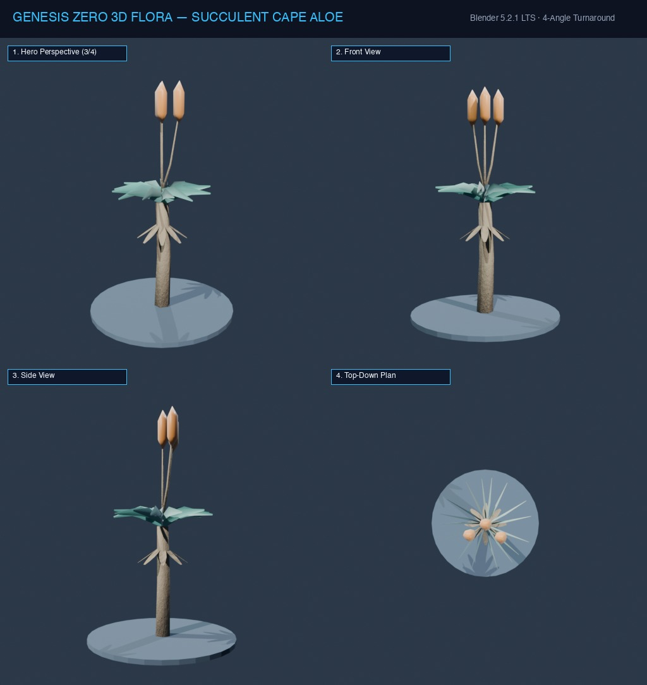

# Đặc Tả Thực Vật 3D: Nha Đam Gai Khổng Lồ (Aloe ferox)

> [!NOTE]
> **Mã Định Danh**: `SC02`  
> **Nhóm Hình Thái**: Arid Succulents  
> **Hệ Thống Phân Loại (APG IV / Phylogeny)**: Angiosperms > Eudicots > Asphodelaceae
> **Họ Thực Vật (Family)**: *Asphodelaceae*  
> **Danh Pháp Khoa Học**: *Aloe ferox*  
> **Mã Cơ Sở Dữ Liệu Đối Chiếu**: POWO: `SC02-POWO` | WFO: `wfo-succulent_cape_aloe` | GBIF: `85358183` | CoL: `SC02` | vncreatures: `N/A`
> **Tên Tiếng Anh**: **Bitter Cape Aloe**  
> **Sinh Cảnh Tự Nhiên**: Vách đá khô cằn gió nóng, Bãi sỏi (Z: 4m - 11m)  
> **Kích Thước Không Gian**: 2.3m (Cao) x 1.85m (Tán)  
> **Tiêu Chuẩn Đồ Họa**: **Hyper-Realistic Scan-Quality**

---
## Bản Vẽ Thiết Kế 3D Model Sheet (4 Góc Nhìn: Phối Cảnh, Mặt Trước, Mặt Bên, Nhìn Từ Trên)



---


## 1. Giải Phẫu Hình Thái Thực Vật Học (Botanical Anatomy)

### 1.1 Cấu Trúc Tổng Quan
Thân đơn hóa gỗ bao phủ bởi lớp lá già khô héo rủ xuống như chiếc váy bảo vệ thân. Đỉnh trổ đóa hoa hồng khổng lồ gồm các bẹ lá mọng nước dày cộm viền gai đỏ tía nhọn hoắt. Giữa đóa vươn cành hoa lửa cam rực rỡ.

### 1.2 Chi Tiết Vi Mô & Dấu Ấn Scan (Micro-Geometry & Surface Detail)
Thịt lá chứa khối thạch nha đam trong suốt, vỏ lá dày có các gai nhọn màu đỏ cam phân bố cả ở mép lá và hai mặt lưng bụng.

---

## 2. Thông Số Kiến Trúc Lưới 3D (3D Mesh Topology & LODs)

| Thông Số Lưới | Tiêu Chuẩn Scan-Quality | Mô Tả Kỹ Thuật |
|:---|:---|:---|
| **LOD0 (Ultra High)** | **38,000 tris** | Lưới Quads sạch 100%, Manifold kín nước, hỗ trợ Subdivision Surface |
| **LOD1 (Game Engine)** | **9,200 tris** | Tối ưu hóa render thời gian thực, giữ nguyên vẹn Normal Map vi mô |
| **LOD2 (Diorama/Far)** | ~1,200 - 2,500 tris | Dạng Billboard / Low-poly cho góc nhìn viễn cảnh toàn cảnh diorama |
| **Smooth Shading** | `use_smooth = True` | Kích hoạt 100% trên toàn bộ các mặt đa giác, triệt tiêu gãy khúc |
| **UV Unwrapping** | Non-overlapping Island | Tỷ lệ Texel Density đồng đều (2048 px/m), seam giấu khéo léo |

---

## 3. Hệ Thống Vật Liệu Sinh Học PBR (Biological PBR Shader Network)

Vật liệu được xây dựng trên hệ thống Shader chuyên sâu của Blender 5.2.1 LTS:

- **Shader Profile**: `Principled BSDF: Lá xanh lam xỉn tráng sáp (#0f766e), SSS 0.50 (thấu quang thạch trong suốt bên trong), Gai đỏ rực (#b91c1c), Chùm hoa lửa cam cháy (#ea580c, SSS 0.60).`
- **Subsurface Scattering (SSS)**: Tái hiện chân thực cơ chế ánh sáng đi sâu vào mô tế bào diệp lục và tán xạ ngược ra ngoài khi ngược sáng.
- **Normal & Procedural Displacement**: Tái tạo các khe nứt vỏ cây già cỗi, gờ sống lá, lông tơ nhung và độ cong vi mô của cánh hoa.
- **Color Management**: Tối ưu hóa chuẩn không gian màu **AgX (Medium High Contrast)** cho hình ảnh chân thực và rực rỡ.

---

## 4. Đường Dẫn Tài Nguyên File 3D (Direct Asset Links)

Bạn có thể mở trực tiếp các file 3D của loài thực vật này tại các liên kết sau:

- 📷 **Bản Vẽ Turnaround 4 Góc**: [`succulent_cape_aloe_turnaround.jpg`](../images/succulent_cape_aloe_turnaround.jpg)
- 🎨 **Tài Liệu Chi Tiết Master Catalog**: [`docs/flora/README.md`](../README.md)
- 🌐 **Trình Xem Thực Vật 3D Web**: [`flora_viewer.html`](../../../web/flora_viewer.html)
- 🐍 **Mã Nguồn Sinh Hình Học Procedural**: [`flora_builder.py`](../../../assets/flora/generators/flora_builder.py)

---

## 5. Script Nạp Nhanh Vào Scene Hiện Tại (Python Snippet)

```python
import os
import bpy

asset_path = "/Users/duongnad/Documents/project/Genesis_Zero/assets/flora/arid_succulents/succulent_cape_aloe.glb"
if os.path.exists(asset_path):
    bpy.ops.import_scene.gltf(filepath=asset_path)
    plant = bpy.context.selected_objects[0]
    plant.name = "Flora_succulent_cape_aloe"
    print(f"✓ Đã đặt {plant.name} vào thế giới Genesis Zero.")
else:
    print(f"Asset file đang được sinh bởi flora_builder.py...")
```
