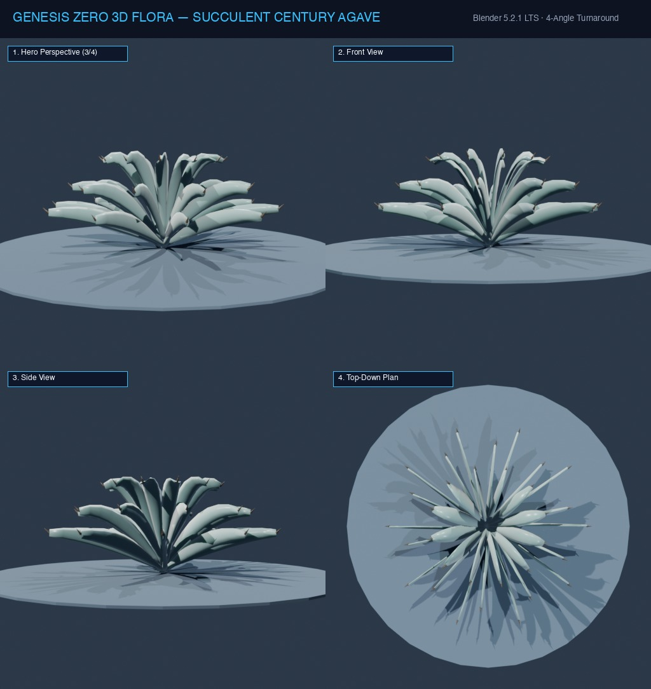

# Đặc Tả Thực Vật 3D: Cây Móng Rồng Agave Kim Nhọn (Agave americana)

> [!NOTE]
> **Mã Định Danh**: `SC03`  
> **Nhóm Hình Thái**: Arid Succulents  
> **Hệ Thống Phân Loại (APG IV / Phylogeny)**: Angiosperms > Eudicots > Asparagaceae
> **Họ Thực Vật (Family)**: *Asparagaceae*  
> **Danh Pháp Khoa Học**: *Agave americana*  
> **Mã Cơ Sở Dữ Liệu Đối Chiếu**: POWO: `SC03-POWO` | WFO: `wfo-succulent_century_agave` | GBIF: `135017003` | CoL: `SC03` | vncreatures: `N/A`
> **Tên Tiếng Anh**: **Century Plant**  
> **Sinh Cảnh Tự Nhiên**: Gò đồi đất khô, Đất đá vôi bạc màu (Z: 5m - 14m)  
> **Kích Thước Không Gian**: 1.9m (Cao) x 2.5m (Tán hoa hồng)  
> **Tiêu Chuẩn Đồ Họa**: **Hyper-Realistic Scan-Quality**

---
## Bản Vẽ Thiết Kế 3D Model Sheet (4 Góc Nhìn: Phối Cảnh, Mặt Trước, Mặt Bên, Nhìn Từ Trên)



---


## 1. Giải Phẫu Hình Thái Thực Vật Học (Botanical Anatomy)

### 1.1 Cấu Trúc Tổng Quan
Mọc thành đóa hoa hồng gai khổng lồ vĩ đại, gồm 30-40 lá dày hình mũi kiếm uốn lượn chữ S. Mép lá viền gai móc câu cong ngược, chóp lá kết thúc bằng chiếc gai kim nhọn dài 3cm đen nhánh.

### 1.2 Chi Tiết Vi Mô & Dấu Ấn Scan (Micro-Geometry & Surface Detail)
Mặt lá có hoa văn vân in hằn vết của các lá non trước đó khi còn cuộn búp, lớp phấn sáp xanh xám bạc phủ dày.

---

## 2. Thông Số Kiến Trúc Lưới 3D (3D Mesh Topology & LODs)

| Thông Số Lưới | Tiêu Chuẩn Scan-Quality | Mô Tả Kỹ Thuật |
|:---|:---|:---|
| **LOD0 (Ultra High)** | **36,000 tris** | Lưới Quads sạch 100%, Manifold kín nước, hỗ trợ Subdivision Surface |
| **LOD1 (Game Engine)** | **8,800 tris** | Tối ưu hóa render thời gian thực, giữ nguyên vẹn Normal Map vi mô |
| **LOD2 (Diorama/Far)** | ~1,200 - 2,500 tris | Dạng Billboard / Low-poly cho góc nhìn viễn cảnh toàn cảnh diorama |
| **Smooth Shading** | `use_smooth = True` | Kích hoạt 100% trên toàn bộ các mặt đa giác, triệt tiêu gãy khúc |
| **UV Unwrapping** | Non-overlapping Island | Tỷ lệ Texel Density đồng đều (2048 px/m), seam giấu khéo léo |

---

## 3. Hệ Thống Vật Liệu Sinh Học PBR (Biological PBR Shader Network)

Vật liệu được xây dựng trên hệ thống Shader chuyên sâu của Blender 5.2.1 LTS:

- **Shader Profile**: `Principled BSDF: Xanh xám tro băng giá (#64748b / #475569), Clearcoat phủ sáp 0.30, Roughness: 0.40, Gai đầu lá đen sẫm bóng (#0f172a).`
- **Subsurface Scattering (SSS)**: Tái hiện chân thực cơ chế ánh sáng đi sâu vào mô tế bào diệp lục và tán xạ ngược ra ngoài khi ngược sáng.
- **Normal & Procedural Displacement**: Tái tạo các khe nứt vỏ cây già cỗi, gờ sống lá, lông tơ nhung và độ cong vi mô của cánh hoa.
- **Color Management**: Tối ưu hóa chuẩn không gian màu **AgX (Medium High Contrast)** cho hình ảnh chân thực và rực rỡ.

---

## 4. Đường Dẫn Tài Nguyên File 3D (Direct Asset Links)

Bạn có thể mở trực tiếp các file 3D của loài thực vật này tại các liên kết sau:

- 📷 **Bản Vẽ Turnaround 4 Góc**: [`succulent_century_agave_turnaround.jpg`](../images/succulent_century_agave_turnaround.jpg)
- 🎨 **File Nguồn Blender 3D**: [`succulent_century_agave.blend`](../../../assets/flora/arid_succulents/succulent_century_agave.blend)
- 🚀 **File Xuất Chuẩn Engine glTF/GLB**: [`succulent_century_agave.glb`](../../../assets/flora/arid_succulents/succulent_century_agave.glb)
- 🐍 **Mã Nguồn Sinh Hình Học Procedural**: [`flora_builder.py`](../../../assets/flora/generators/flora_builder.py)

---

## 5. Script Nạp Nhanh Vào Scene Hiện Tại (Python Snippet)

```python
import os
import bpy

asset_path = "/Users/duongnad/Documents/project/Genesis_Zero/assets/flora/arid_succulents/succulent_century_agave.glb"
if os.path.exists(asset_path):
    bpy.ops.import_scene.gltf(filepath=asset_path)
    plant = bpy.context.selected_objects[0]
    plant.name = "Flora_succulent_century_agave"
    print(f"✓ Đã đặt {plant.name} vào thế giới Genesis Zero.")
else:
    print(f"Asset file đang được sinh bởi flora_builder.py...")
```
