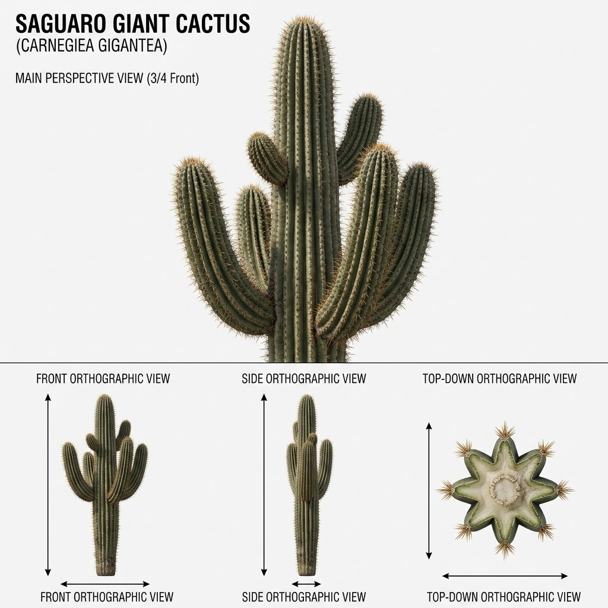

# Đặc Tả Thực Vật 3D: Xương Rồng Trụ Saguaro Cổ Thụ (Carnegiea gigantea)

> [!NOTE]
> **Mã Định Danh**: `SC01`  
> **Nhóm Hình Thái**: Arid Succulents  
> **Hệ Thống Phân Loại (APG IV / Phylogeny)**: Angiosperms > Eudicots > Superasterids > Caryophyllales > Cactaceae  
> **Danh Pháp Khoa Học**: *Carnegiea gigantea* (Engelm.) Britton & Rose  
> **Tên Tiếng Anh**: **Saguaro Giant Cactus**  
> **Tầng Sinh Thái**: Sa Mạc & Mọng Nước (Desert & Succulents)  
> **Kích Thước Không Gian**: 12m (Cao) x 3.4m (Tán tay) x 0.65m (Đường kính thân)  
> **Mã Cơ Sở Dữ Liệu Đối Chiếu**: POWO: `62495-2` | WFO: `wfo-0000587219` | GBIF: `3084347` | CoL: `5X9TC` | vncreatures: `N/A`  
> **Tình Trạng Bảo Tồn**: IUCN Red List: LC (Least Concern) | CITES: Appendix II  
> **Phân Bố Tự Nhiên**: Sa mạc Sonoran (Arizona, California, Sonora)  
> **Sinh Cảnh Genesis Zero**: Đỉnh đồi cằn cỗi, vùng đất cát khô hạn (Z: 5m - 12m)  
> **Tiêu Chuẩn Đồ Họa**: **Hyper-Realistic Scan-Quality (Blender PBR + SSS)**

---

## Bản Vẽ Thiết Kế 3D Model Sheet (4 Góc Nhìn: Phối Cảnh, Mặt Trước, Mặt Bên, Nhìn Từ Trên)



---


## 1. Giải Phẫu Hình Thái Thực Vật Học (Botanical Anatomy)

### 1.1 Cấu Trúc Tổng Quan
Cột thân khổng lồ hình trụ dày đặc các nếp khía dọc sâu như đàn phong cầm. Cây trưởng thành vươn 2-5 cánh tay uốn cong hướng lên trời kiêu hãnh.

### 1.2 Chi Tiết Vi Mô & Dấu Ấn Scan (Micro-Geometry & Surface Detail)
Các khía rãnh dọc phồng xẹp theo lượng nước trữ, bờ khía cắm các quầng gai (areoles) nâu len dày đặc tỏa 15-20 chiếc gai thép cứng dài 5cm nhọn hoắt.

---

## 2. Thông Số Kiến Trúc Lưới 3D (3D Mesh Topology & LODs)

| Thông Số Lưới | Tiêu Chuẩn Scan-Quality | Mô Tả Kỹ Thuật |
|:---|:---|:---|
| **LOD0 (Ultra High)** | **54,000 tris** | Lưới Quads sạch 100%, Manifold kín nước, hỗ trợ Subdivision Surface |
| **LOD1 (Game Engine)** | **13,500 tris** | Tối ưu hóa render thời gian thực, giữ nguyên vẹn Normal Map vi mô |
| **LOD2 (Diorama/Far)** | ~1,200 - 2,500 tris | Dạng Billboard / Low-poly cho góc nhìn viễn cảnh toàn cảnh diorama |
| **Smooth Shading** | `use_smooth = True` | Kích hoạt 100% trên toàn bộ các mặt đa giác, triệt tiêu gãy khúc |
| **UV Unwrapping** | Non-overlapping Island | Tỷ lệ Texel Density đồng đều (2048 px/m), seam giấu khéo léo |

---

## 3. Hệ Thống Vật Liệu Sinh Học PBR (Biological PBR Shader Network)

Vật liệu được xây dựng trên hệ thống Shader chuyên sâu của Blender 5.2.1 LTS:

- **Shader Profile**: `Principled BSDF: Thân xanh xám sáp mờ phủ phấn (#047857 / #065f46, Roughness 0.38, SSS mọng nước 0.30), Gai thép màu vàng nâu sừng (#78350f, Roughness 0.20).`
- **Subsurface Scattering (SSS)**: Tái hiện chân thực cơ chế ánh sáng đi sâu vào mô tế bào diệp lục và tán xạ ngược ra ngoài khi ngược sáng.
- **Normal & Procedural Displacement**: Tái tạo các khe nứt vỏ cây già cỗi, gờ sống lá, lông tơ nhung và độ cong vi mô của cánh hoa.
- **Color Management**: Tối ưu hóa chuẩn không gian màu **AgX (Medium High Contrast)** cho hình ảnh chân thực và rực rỡ.

---

## 4. Đường Dẫn Tài Nguyên File 3D (Direct Asset Links)

Bạn có thể mở trực tiếp các file 3D của loài thực vật này tại các liên kết sau:

- 🎨 **File Nguồn Blender 3D**: [`succulent_saguaro_cactus.blend`](../../../assets/flora/arid_succulents/succulent_saguaro_cactus.blend)
- 🚀 **File Xuất Chuẩn Engine glTF/GLB**: [`succulent_saguaro_cactus.glb`](../../../assets/flora/arid_succulents/succulent_saguaro_cactus.glb)
- 📷 **Bản Vẽ Turnaround 4 Góc**: [`succulent_saguaro_cactus_turnaround.jpg`](../images/succulent_saguaro_cactus_turnaround.jpg)
- 🐍 **Mã Nguồn Sinh Hình Học Procedural**: [`flora_builder.py`](../../../assets/flora/generators/flora_builder.py)

---

## 5. Script Nạp Nhanh Vào Scene Hiện Tại (Python Snippet)

```python
import os
import bpy

asset_path = "/Users/duongnad/Documents/project/Genesis_Zero/assets/flora/arid_succulents/succulent_saguaro_cactus.glb"
if os.path.exists(asset_path):
    bpy.ops.import_scene.gltf(filepath=asset_path)
    plant = bpy.context.selected_objects[0]
    plant.name = "Flora_succulent_saguaro_cactus"
    print(f"✓ Đã đặt {plant.name} vào thế giới Genesis Zero.")
else:
    print(f"Asset file đang được sinh bởi flora_builder.py...")
```
