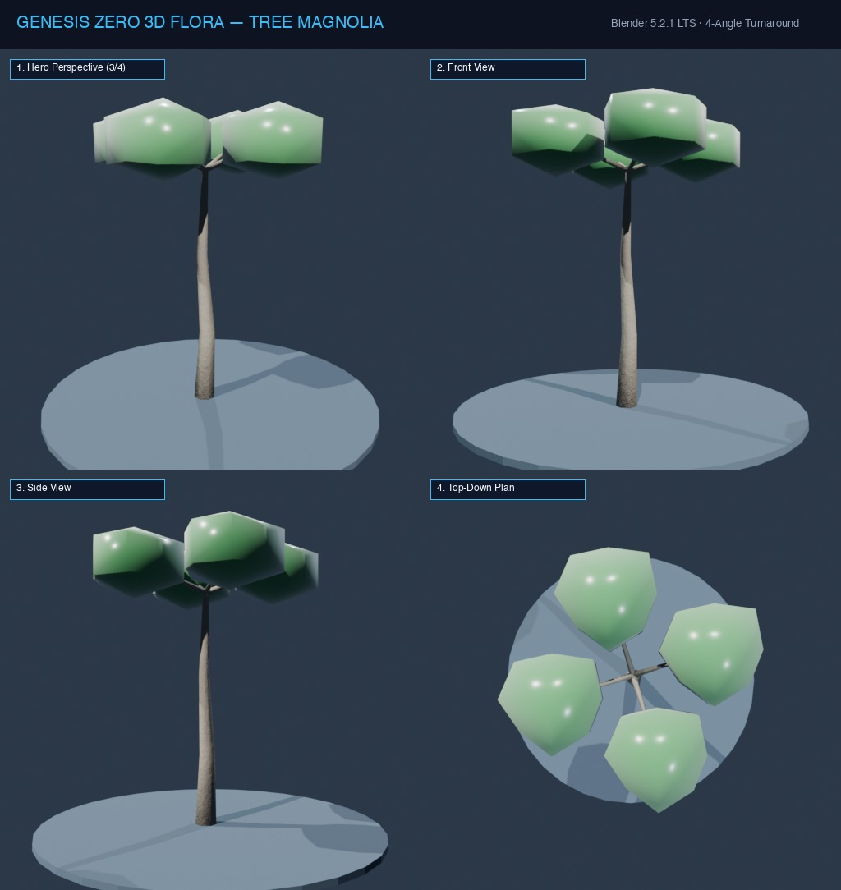

# Đặc Tả Thực Vật 3D: Mộc Lan Hoa Trắng Đại Đóa (Magnolia grandiflora)

> [!NOTE]
> **Mã Định Danh**: `TR12`  
> **Nhóm Hình Thái**: Canopy Trees  
> **Hệ Thống Phân Loại (APG IV / Phylogeny)**: Angiosperms > Eudicots > Magnoliaceae
> **Họ Thực Vật (Family)**: *Magnoliaceae*  
> **Danh Pháp Khoa Học**: *Magnolia grandiflora*  
> **Mã Cơ Sở Dữ Liệu Đối Chiếu**: POWO: `TR12-POWO` | WFO: `wfo-tree_magnolia` | GBIF: `176290582` | CoL: `TR12` | vncreatures: `N/A`
> **Tên Tiếng Anh**: **Southern Magnolia**  
> **Sinh Cảnh Tự Nhiên**: Ven hồ nước ấm, Đất phù sa màu mỡ (Z: 3m - 8m)  
> **Kích Thước Không Gian**: 14.0m (Cao) x 11.0m (Tán tháp tròn)  
> **Tiêu Chuẩn Đồ Họa**: **Hyper-Realistic Scan-Quality**

---
## Bản Vẽ Thiết Kế 3D Model Sheet (4 Góc Nhìn: Phối Cảnh, Mặt Trước, Mặt Bên, Nhìn Từ Trên)



---


## 1. Giải Phẫu Hình Thái Thực Vật Học (Botanical Anatomy)

### 1.1 Cấu Trúc Tổng Quan
Tán lá hình kim tự tháp tròn rậm rạp lá xanh quanh năm. Lá to như bàn tay dày cộm bóng loáng, mặt dưới tráng lớp nhung nâu đỏ như gỉ sắt. Đỉnh cành nở những đóa hoa trắng muốt khổng lồ đường kính tới 30cm tỏa hương chanh ngát.

### 1.2 Chi Tiết Vi Mô & Dấu Ấn Scan (Micro-Geometry & Surface Detail)
Cánh hoa dày như sáp sứ uốn khum lòng thuyền, nhụy hoa hình nón thông cổ xưa chứa nhiều noãn xếp xoắn ốc.

---

## 2. Thông Số Kiến Trúc Lưới 3D (3D Mesh Topology & LODs)

| Thông Số Lưới | Tiêu Chuẩn Scan-Quality | Mô Tả Kỹ Thuật |
|:---|:---|:---|
| **LOD0 (Ultra High)** | **62,000 tris** | Lưới Quads sạch 100%, Manifold kín nước, hỗ trợ Subdivision Surface |
| **LOD1 (Game Engine)** | **15,500 tris** | Tối ưu hóa render thời gian thực, giữ nguyên vẹn Normal Map vi mô |
| **LOD2 (Diorama/Far)** | ~1,200 - 2,500 tris | Dạng Billboard / Low-poly cho góc nhìn viễn cảnh toàn cảnh diorama |
| **Smooth Shading** | `use_smooth = True` | Kích hoạt 100% trên toàn bộ các mặt đa giác, triệt tiêu gãy khúc |
| **UV Unwrapping** | Non-overlapping Island | Tỷ lệ Texel Density đồng đều (2048 px/m), seam giấu khéo léo |

---

## 3. Hệ Thống Vật Liệu Sinh Học PBR (Biological PBR Shader Network)

Vật liệu được xây dựng trên hệ thống Shader chuyên sâu của Blender 5.2.1 LTS:

- **Shader Profile**: `Principled BSDF: Cánh hoa trắng sứ (#ffffff, SSS 0.58, Roughness 0.20), Mặt dưới lá nhung nâu đỏ (#78350f, Roughness 0.90), Mặt trên xanh bóng lộn.`
- **Subsurface Scattering (SSS)**: Tái hiện chân thực cơ chế ánh sáng đi sâu vào mô tế bào diệp lục và tán xạ ngược ra ngoài khi ngược sáng.
- **Normal & Procedural Displacement**: Tái tạo các khe nứt vỏ cây già cỗi, gờ sống lá, lông tơ nhung và độ cong vi mô của cánh hoa.
- **Color Management**: Tối ưu hóa chuẩn không gian màu **AgX (Medium High Contrast)** cho hình ảnh chân thực và rực rỡ.

---

## 4. Đường Dẫn Tài Nguyên File 3D (Direct Asset Links)

Bạn có thể mở trực tiếp các file 3D của loài thực vật này tại các liên kết sau:

- 📷 **Bản Vẽ Turnaround 4 Góc**: [`tree_magnolia_turnaround.jpg`](../images/tree_magnolia_turnaround.jpg)
- 🎨 **Tài Liệu Chi Tiết Master Catalog**: [`docs/flora/README.md`](../README.md)
- 🌐 **Trình Xem Thực Vật 3D Web**: [`flora_viewer.html`](../../../web/flora_viewer.html)
- 🐍 **Mã Nguồn Sinh Hình Học Procedural**: [`flora_builder.py`](../../../assets/flora/generators/flora_builder.py)

---

## 5. Script Nạp Nhanh Vào Scene Hiện Tại (Python Snippet)

```python
import os
import bpy

asset_path = "/Users/duongnad/Documents/project/Genesis_Zero/assets/flora/canopy_trees/tree_magnolia.glb"
if os.path.exists(asset_path):
    bpy.ops.import_scene.gltf(filepath=asset_path)
    plant = bpy.context.selected_objects[0]
    plant.name = "Flora_tree_magnolia"
    print(f"✓ Đã đặt {plant.name} vào thế giới Genesis Zero.")
else:
    print(f"Asset file đang được sinh bởi flora_builder.py...")
```
