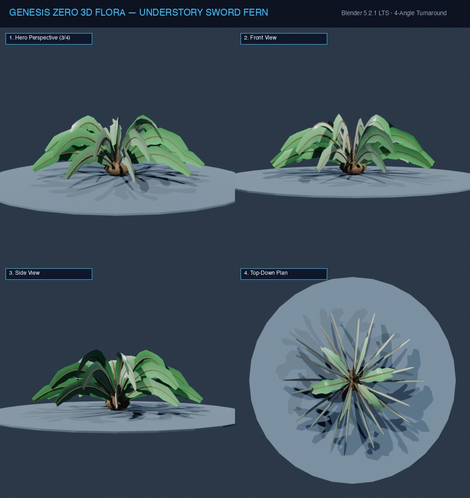

# Đặc Tả Thực Vật 3D: Dương Xỉ Kiếm Khổng Lồ (Polystichum munitum)

> [!NOTE]
> **Mã Định Danh**: `SH01`  
> **Nhóm Hình Thái**: Understory Shrubs  
> **Hệ Thống Phân Loại (APG IV / Phylogeny)**: Angiosperms > Eudicots > Dryopteridaceae
> **Họ Thực Vật (Family)**: *Dryopteridaceae*  
> **Danh Pháp Khoa Học**: *Polystichum munitum*  
> **Mã Cơ Sở Dữ Liệu Đối Chiếu**: POWO: `SH01-POWO` | WFO: `wfo-understory_sword_fern` | GBIF: `19752672` | CoL: `SH01` | vncreatures: `N/A`
> **Tên Tiếng Anh**: **Western Sword Fern**  
> **Sinh Cảnh Tự Nhiên**: Tầng dưới rừng sồi ẩm, Hẻm núi đá (Z: 3m - 10m)  
> **Kích Thước Không Gian**: 1.45m (Cao) x 1.65m (Tán)  
> **Tiêu Chuẩn Đồ Họa**: **Hyper-Realistic Scan-Quality**

---
## Bản Vẽ Thiết Kế 3D Model Sheet (4 Góc Nhìn: Phối Cảnh, Mặt Trước, Mặt Bên, Nhìn Từ Trên)



---


## 1. Giải Phẫu Hình Thái Thực Vật Học (Botanical Anatomy)

### 1.1 Cấu Trúc Tổng Quan
Gốc mọc tỏa tròn hình phễu với 30-50 tàu lá kiếm xòe rộng đối xứng. Từng lá chét có hình lưỡi liềm với cuống nhỏ và tai lá nhọn ở gốc, mép răng cưa sắc.

### 1.2 Chi Tiết Vi Mô & Dấu Ấn Scan (Micro-Geometry & Surface Detail)
Mặt dưới lá chét mang hai hàng ổ túi bào tử (sori) tròn màu nâu vàng xếp đều đặn hai bên gân chính, phiến lá bóng dày có gân phụ xẻ rãnh.

---

## 2. Thông Số Kiến Trúc Lưới 3D (3D Mesh Topology & LODs)

| Thông Số Lưới | Tiêu Chuẩn Scan-Quality | Mô Tả Kỹ Thuật |
|:---|:---|:---|
| **LOD0 (Ultra High)** | **48,000 tris** | Lưới Quads sạch 100%, Manifold kín nước, hỗ trợ Subdivision Surface |
| **LOD1 (Game Engine)** | **12,000 tris** | Tối ưu hóa render thời gian thực, giữ nguyên vẹn Normal Map vi mô |
| **LOD2 (Diorama/Far)** | ~1,200 - 2,500 tris | Dạng Billboard / Low-poly cho góc nhìn viễn cảnh toàn cảnh diorama |
| **Smooth Shading** | `use_smooth = True` | Kích hoạt 100% trên toàn bộ các mặt đa giác, triệt tiêu gãy khúc |
| **UV Unwrapping** | Non-overlapping Island | Tỷ lệ Texel Density đồng đều (2048 px/m), seam giấu khéo léo |

---

## 3. Hệ Thống Vật Liệu Sinh Học PBR (Biological PBR Shader Network)

Vật liệu được xây dựng trên hệ thống Shader chuyên sâu của Blender 5.2.1 LTS:

- **Shader Profile**: `Principled BSDF: Xanh lục bảo sẫm (#15803d), mặt trên bóng bẩy Roughness: 0.32, Clearcoat: 0.15, SSS Weight: 0.42, túi bào tử nâu đất (#78350f).`
- **Subsurface Scattering (SSS)**: Tái hiện chân thực cơ chế ánh sáng đi sâu vào mô tế bào diệp lục và tán xạ ngược ra ngoài khi ngược sáng.
- **Normal & Procedural Displacement**: Tái tạo các khe nứt vỏ cây già cỗi, gờ sống lá, lông tơ nhung và độ cong vi mô của cánh hoa.
- **Color Management**: Tối ưu hóa chuẩn không gian màu **AgX (Medium High Contrast)** cho hình ảnh chân thực và rực rỡ.

---

## 4. Đường Dẫn Tài Nguyên File 3D (Direct Asset Links)

Bạn có thể mở trực tiếp các file 3D của loài thực vật này tại các liên kết sau:

- 📷 **Bản Vẽ Turnaround 4 Góc**: [`understory_sword_fern_turnaround.jpg`](../images/understory_sword_fern_turnaround.jpg)
- 🎨 **File Nguồn Blender 3D**: [`understory_sword_fern.blend`](../../../assets/flora/understory_shrubs/understory_sword_fern.blend)
- 🚀 **File Xuất Chuẩn Engine glTF/GLB**: [`understory_sword_fern.glb`](../../../assets/flora/understory_shrubs/understory_sword_fern.glb)
- 🐍 **Mã Nguồn Sinh Hình Học Procedural**: [`flora_builder.py`](../../../assets/flora/generators/flora_builder.py)

---

## 5. Script Nạp Nhanh Vào Scene Hiện Tại (Python Snippet)

```python
import os
import bpy

asset_path = "/Users/duongnad/Documents/project/Genesis_Zero/assets/flora/understory_shrubs/understory_sword_fern.glb"
if os.path.exists(asset_path):
    bpy.ops.import_scene.gltf(filepath=asset_path)
    plant = bpy.context.selected_objects[0]
    plant.name = "Flora_understory_sword_fern"
    print(f"✓ Đã đặt {plant.name} vào thế giới Genesis Zero.")
else:
    print(f"Asset file đang được sinh bởi flora_builder.py...")
```
