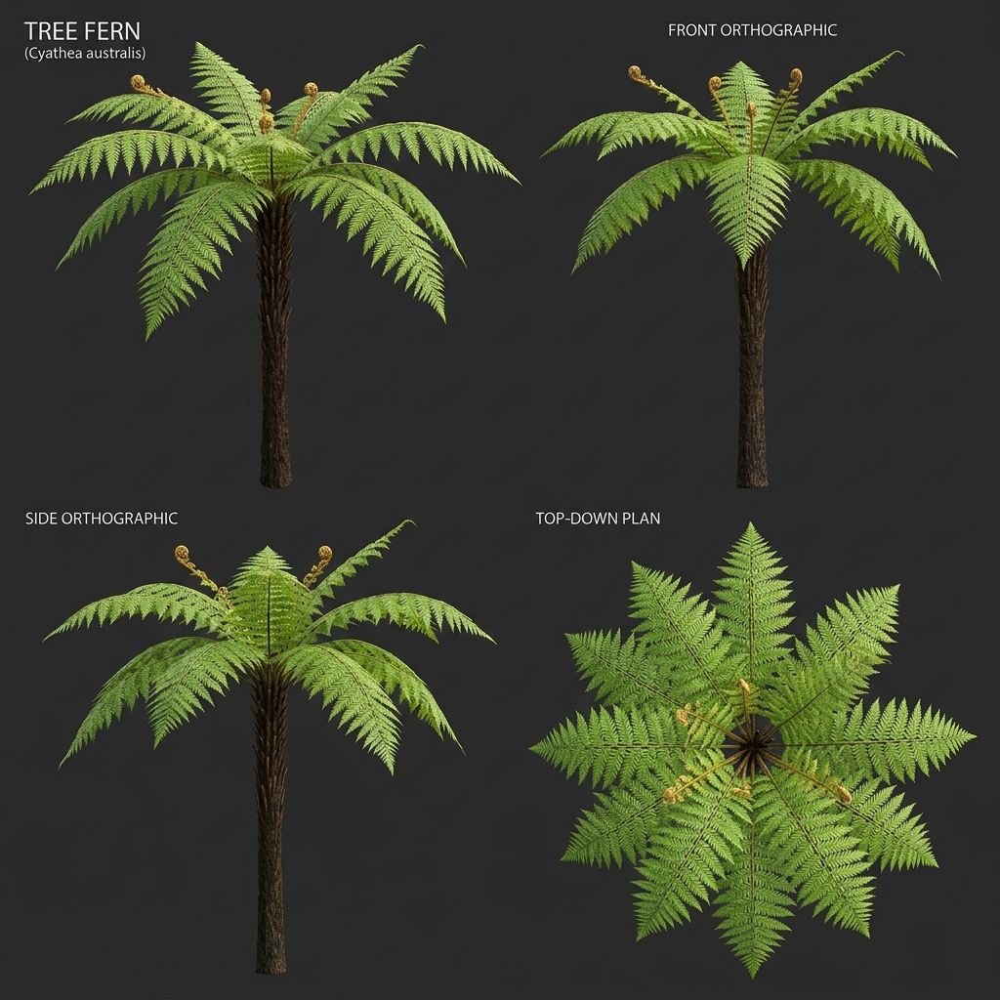

# Đặc Tả Thực Vật 3D: Dương Xỉ Thân Gỗ Cổ Sinh (Cyathea cooperi)

> [!NOTE]
> **Mã Định Danh**: `SH02`  
> **Nhóm Hình Thái**: Understory Shrubs  
> **Hệ Thống Phân Loại (PPG I / Phylogeny)**: Pteridophytes > Polypodiopsida > Cyatheales > Cyatheaceae  
> **Danh Pháp Khoa Học**: *Cyathea cooperi* (F.Muell.) Domin  
> **Tên Tiếng Anh**: **Australian Tree Fern / Lacy Tree Fern**  
> **Tầng Sinh Thái**: Cây Bụi & Dương Xỉ (Shrubs & Ferns)  
> **Kích Thước Không Gian**: 6.5m (Cao) x 5.5m (Tán) x 0.25m (Caudex)  
> **Mã Cơ Sở Dữ Liệu Đối Chiếu**: POWO: `17068550-1` | WFO: `wfo-0001112442` | GBIF: `7299946` | CoL: `32PRK` | vncreatures: Chi *Cyathea* bản địa VN (`VNC0422`)  
> **Tình Trạng Bảo Tồn**: IUCN Red List: LC (Least Concern) | CITES: Appendix II  
> **Phân Bố Tự Nhiên**: Rừng mưa nhiệt đới ẩm, hẻm vực ven suối đông bắc Úc  
> **Sinh Cảnh Genesis Zero**: Tầng cây bụi ẩm ướt, chân vách đá và bờ suối râm mát (Z: 2m - 7m)  
> **Tiêu Chuẩn Đồ Họa**: **Hyper-Realistic Scan-Quality (Blender PBR + SSS)**

---

## Bản Vẽ Thiết Kế 3D Model Sheet (4 Góc Nhìn: Phối Cảnh, Mặt Trước, Mặt Bên, Nhìn Từ Trên)



---

## 1. Giải Phẫu Hình Thái Thực Vật Học (Botanical Anatomy)

### 1.1 Cấu Trúc Tổng Quan
Thân cột gỗ xù xì tạo bởi các vết sẹo cuống lá già xếp lớp vảy rồng, đỉnh thân xòe tán lọng khổng lồ với các tàu lá dương xỉ 3 lần lông chim cong hình vòm cung kỳ vĩ.

### 1.2 Chi Tiết Vi Mô & Dấu Ấn Scan (Micro-Geometry & Surface Detail)
Cuống lá non cuộn tròn hình xoắn ốc (fiddleheads) phủ đầy lông tơ tơ vàng óng ánh như tơ tằm, thân cột có rễ khí sinh đan kết như bím tóc.

---

## 2. Thông Số Kiến Trúc Lưới 3D (3D Mesh Topology & LODs)

| Thông Số Lưới | Tiêu Chuẩn Scan-Quality | Mô Tả Kỹ Thuật |
|:---|:---|:---|
| **LOD0 (Ultra High)** | **65,000 tris** | Lưới Quads sạch 100%, Manifold kín nước, hỗ trợ Subdivision Surface |
| **LOD1 (Game Engine)** | **16,000 tris** | Tối ưu hóa render thời gian thực, giữ nguyên vẹn Normal Map vi mô |
| **LOD2 (Diorama/Far)** | ~1,200 - 2,500 tris | Dạng Billboard / Low-poly cho góc nhìn viễn cảnh toàn cảnh diorama |
| **Smooth Shading** | `use_smooth = True` | Kích hoạt 100% trên toàn bộ các mặt đa giác, triệt tiêu gãy khúc |
| **UV Unwrapping** | Non-overlapping Island | Tỷ lệ Texel Density đồng đều (2048 px/m), seam giấu khéo léo |

---

## 3. Hệ Thống Vật Liệu Sinh Học PBR (Biological PBR Shader Network)

Vật liệu được xây dựng trên hệ thống Shader chuyên sâu của Blender 5.2.1 LTS:

- **Shader Profile**: `Principled BSDF: Thân cột nâu sậm nứt nẻ (#271c14, Roughness 0.90, Normal Bump sâu), Tán lá xanh non tươi sáng SSS 0.50 tán xạ ngược lộng lẫy.`
- **Subsurface Scattering (SSS)**: Tái hiện chân thực cơ chế ánh sáng đi sâu vào mô tế bào diệp lục và tán xạ ngược ra ngoài khi ngược sáng.
- **Normal & Procedural Displacement**: Tái tạo các khe nứt vỏ cây già cỗi, gờ sống lá, lông tơ nhung và độ cong vi mô của cánh hoa.
- **Color Management**: Tối ưu hóa chuẩn không gian màu **AgX (Medium High Contrast)** cho hình ảnh chân thực và rực rỡ.

---

## 4. Đường Dẫn Tài Nguyên File 3D (Direct Asset Links)

Bạn có thể mở trực tiếp các file 3D của loài thực vật này tại các liên kết sau:

- 🎨 **File Nguồn Blender 3D**: [`understory_tree_fern.blend`](../../../assets/flora/understory_shrubs/understory_tree_fern.blend)
- 🚀 **File Xuất Chuẩn Engine glTF/GLB**: [`understory_tree_fern.glb`](../../../assets/flora/understory_shrubs/understory_tree_fern.glb)
- 📷 **Bản Vẽ Turnaround 4 Góc**: [`understory_tree_fern_turnaround.jpg`](../images/understory_tree_fern_turnaround.jpg)
- 🐍 **Mã Nguồn Sinh Hình Học Procedural**: [`flora_builder.py`](../../../assets/flora/generators/flora_builder.py)

---

## 5. Script Nạp Nhanh Vào Scene Hiện Tại (Python Snippet)

```python
import os
import bpy

asset_path = "/Users/duongnad/Documents/project/Genesis_Zero/assets/flora/understory_shrubs/understory_tree_fern.glb"
if os.path.exists(asset_path):
    bpy.ops.import_scene.gltf(filepath=asset_path)
    plant = bpy.context.selected_objects[0]
    plant.name = "Flora_understory_tree_fern"
    print(f"✓ Đã đặt {plant.name} vào thế giới Genesis Zero.")
else:
    print(f"Asset file đang được sinh bởi flora_builder.py...")
```
